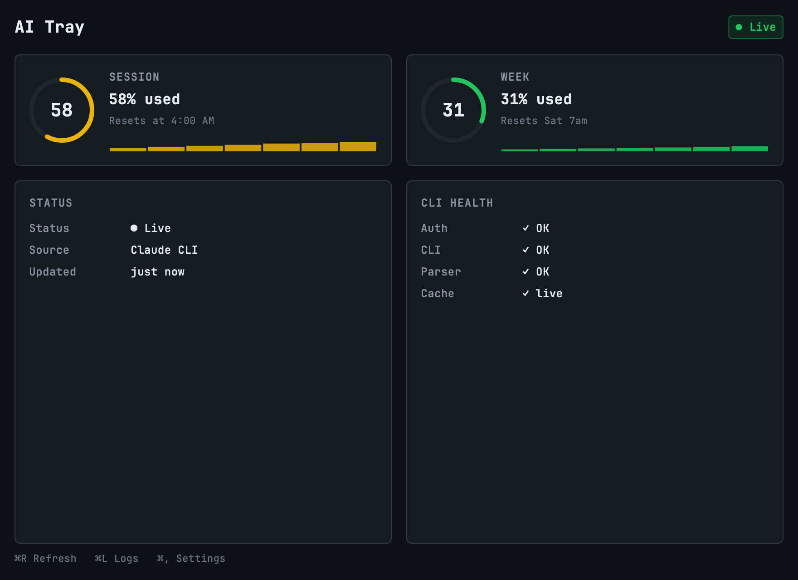
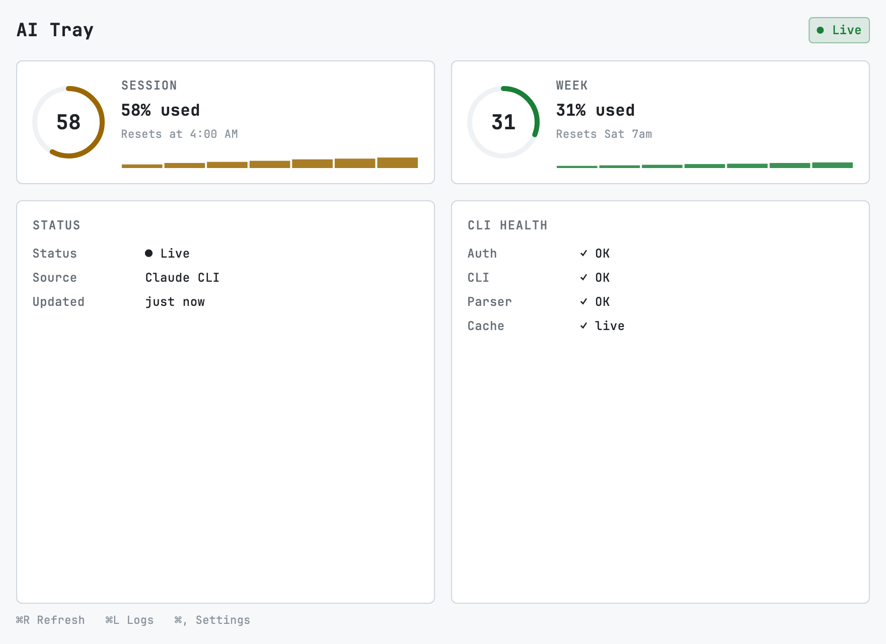
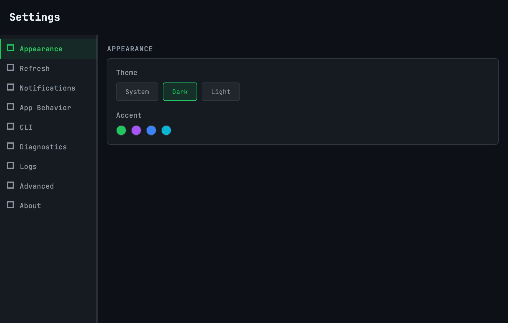
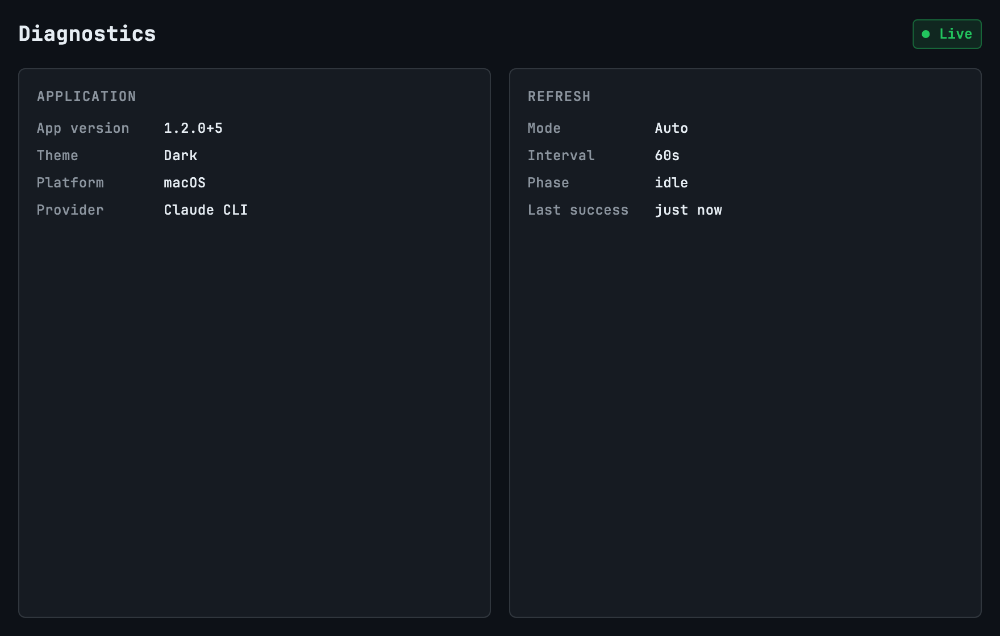
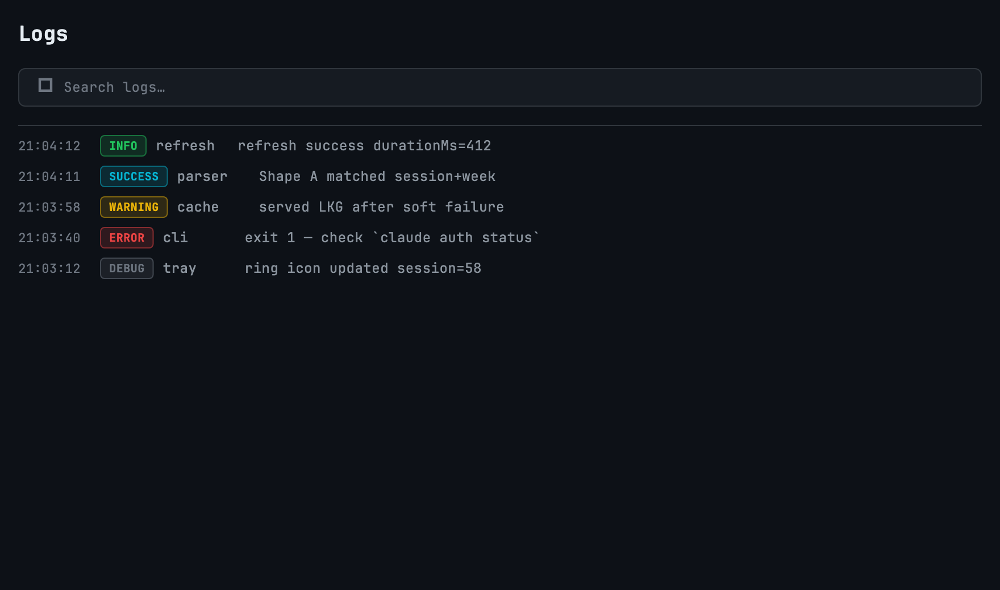

# AI Tray

Native desktop companion for **Claude Code** subscription usage (macOS menu bar / Windows system tray).

**Status:** **v1.2.0** · design system (PD-021)  
**Platforms:** **macOS supported** · **Windows Experimental** ([PD-010](docs/stabilization/PD-010-defer-windows.md))

## Screenshots

Dark dashboard with session / week rings and CLI health:



Light theme:



Settings with left navigation rail:



Diagnostics · Logs · Menu bar tray rings:

| Diagnostics | Logs |
| --- | --- |
|  |  |


*Tray (L→R): Live · Cached · Refreshing · Error*

## Quick links

| | |
|--|--|
| App package | [ai_tray/](ai_tray/) · [ai_tray/README.md](ai_tray/README.md) |
| Design system | [docs/design/DESIGN_SYSTEM.md](docs/design/DESIGN_SYSTEM.md) |
| Docs index | [docs/README.md](docs/README.md) |
| Releases | [GitHub Releases](https://github.com/roshandroids/AI_Tray/releases) |
| **CI/CD** | [docs/release/CI-CD.md](docs/release/CI-CD.md) |
| Install | [docs/guides/installation.md](docs/guides/installation.md) |
| User guide | [docs/guides/user-guide.md](docs/guides/user-guide.md) |
| Troubleshooting | [docs/guides/troubleshooting.md](docs/guides/troubleshooting.md) |
| Known issues | [docs/release/known-issues.md](docs/release/known-issues.md) |

## Install

See [installation guide](docs/guides/installation.md). Latest builds: [v1.2.0](https://github.com/roshandroids/AI_Tray/releases/tag/v1.2.0).

## Run (macOS)

```bash
cd ai_tray
flutter pub get
flutter run -d macos
```

## Product & process (historical)

- [AI_Tray_Product_Owner_Master_Roadmap.md](AI_Tray_Product_Owner_Master_Roadmap.md)
- [AI_Tray_Autonomous_Execution_Guide.md](AI_Tray_Autonomous_Execution_Guide.md)
- Research PoC: [research/claude-cli.md](research/claude-cli.md)

## Dogfooding

Log observations in [docs/dogfood/daily-observation-log.md](docs/dogfood/daily-observation-log.md). No new features without evidence from use and Product Owner approval.
