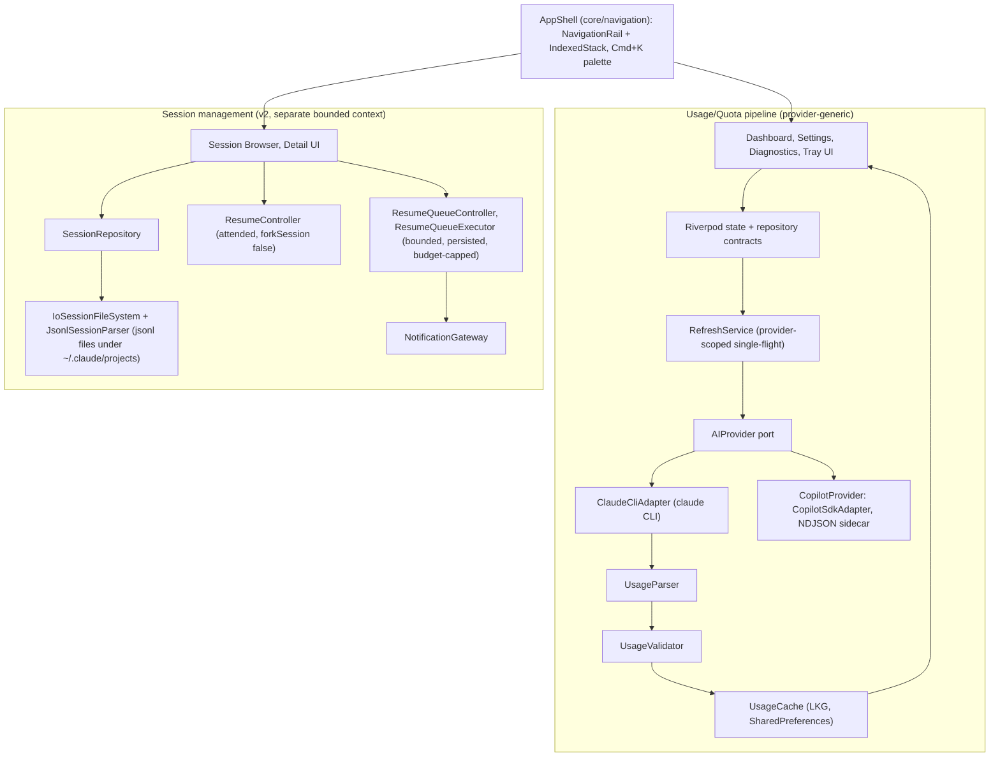

# System architecture

## System shape (verified against `ai_tray/lib`, 2026-08-09)

Two mostly-independent bounded contexts share only the app shell and a couple
of cross-cutting services (`NotificationGateway`, `ClaudeSessionService`).

See [[cli-integration]], [[caching-strategy]], [[usage-data-model]] for the
mechanics inside the usage pipeline, and [[platform-integration]] for the
tray/menu-bar surface.

## Layer responsibilities

| Layer | Responsibility |
| --- | --- |
| UI | Render shared provider/session state; no external I/O or business rules |
| State | Riverpod async orchestration, persisted selection, retries, user actions |
| Domain | Provider contracts, capabilities, usage/quota/session models |
| Data | CLI/SDK process execution, DTO mapping, cache, repositories |
| Sidecar | Isolates the Node Copilot SDK/runtime from Flutter behind versioned NDJSON |

## The historical linear diagram (superseded)

Older docs (and this BRAIN's own drafting instructions) describe the usage
pipeline as a strictly linear
`UI → Repository → RefreshService → ClaudeCliAdapter → Parser → Validator → Cache`.
That is still directionally true for a **single provider's fetch call**, but
misses two things confirmed in code (`refresh_service.dart`):

- `RefreshService` is **provider-generic**, not Claude-specific — it depends
  on the `AIProvider` port and a `ProviderId`-keyed in-flight map, so the same
  service drives both `ClaudeCliAdapter` and the Copilot adapter.
- It isn't a one-shot pipe: it does provider-scoped **single-flight**
  coalescing, a bounded retry pass, then hands off to `UsageValidator` and
  `UsageCache` — see [[caching-strategy]] for the exact retry/fallback rules.

## What changed in V3/V4 that older architecture docs miss

`docs/project/ARCHITECTURE_STATE.md` (last updated 2026-08-02) predates the
v1.4.0 "V3 redesign" (shipped 2026-08-05) and describes neither the shell nor
the newer shared UI primitives. Verified in code:

- `core/navigation/app_shell.dart` — persistent `AppShell`
  (NavigationRail + IndexedStack) replacing ad hoc `Navigator.push`.
- `core/navigation/command_palette.dart` — global Cmd+K palette sharing one
  action registry with shell navigation.
- `features/onboarding/`, `features/help/` — first-launch onboarding + Help
  Center, new in v1.4.0.
- `core/components/status_presentation.dart` and friends — shared
  breakpoint-aware primitives (`ResponsiveGrid`, `PageHeader`, `EmptyState`)
  unifying status colors/labels across pages (V4 responsive foundations).
- `features/tray/presentation/tray_ring_icon_renderer.dart` — dynamic
  color-coded usage-band ring icon, replacing the static monochrome glyph +
  manual opacity-pulse timer described in the pre-V3 docs.

Treat `docs/project/ARCHITECTURE_STATE.md` as informative for the
pre-2026-08-05 provider-platform shape only; this page plus [[platform-integration]]
are the current source for shell/tray structure. See `roadmap` for the open
question of whether the docs/project package will be resynced.

## Provider contracts (stable since [ADR-003](../docs/adr/ADR-003-provider-platform.md) / PD-021)

- `AIProvider`: metadata, capabilities, parser, raw usage fetch, health check
- `ProviderRegistry`: registration, enabled filtering, default resolution
- `ProviderCapabilities`: drives shared UI without provider-specific pages
- `UsageInfo.metrics`: canonical provider-neutral metric list

## Known architectural debt

- Compatibility alias files remain under provider `domain/` and `copilot/`
  — real consumers still import them (per
  `docs/project/ARCHITECTURE_STATE.md`, 2026-08-03: ~23, down from ~35 —
  treat that count as stale like the rest of that doc, not re-verified
  here).
  [ADR-004](../docs/adr/ADR-004-provider-platform-post-EP002-assessment.md)
  / PD-024 scope this as a **targeted cleanup** (canonicalize imports,
  deprecate aliases), explicitly **not** a full rewrite. See
  [[rejected-approaches]].
- `docs/project/*` (the AI_HANDOFF/ARCHITECTURE_STATE/PROJECT_STATE/etc.
  package) has not been updated since 2026-08-03, i.e. it predates both
  v1.4.0 and v1.5.0. Don't trust its "current phase: release freeze" framing
  without checking `CHANGELOG.md` and `git log` first — see `roadmap`.
