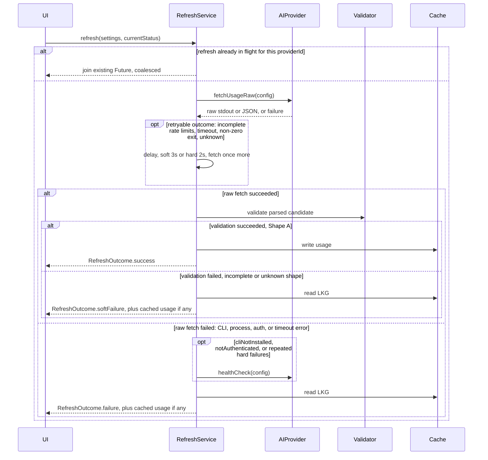
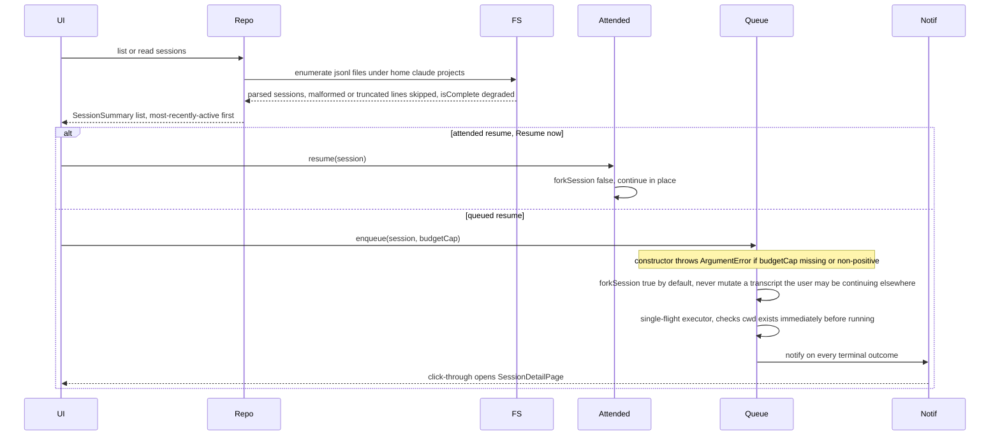

# Key flows

## Usage refresh flow

Verified against `features/usage/data/services/refresh_service.dart`.

`AIProvider` above is whichever adapter is active (Claude or Copilot);
`Cache` is the Last-Known-Good `UsageCache`.

See [[caching-strategy]] for exactly which failures are soft vs hard and why,
and [[usage-data-model]] for how `RefreshOutcome` + `isFromCache` map to the
`Live / Cached / Refreshing / Error / Waiting` status the UI shows.

## Session resume / queue flow (v2, separate context)

Non-goals for this flow today: no cooperative cancellation of a `running`
item (only `pending` items can be cancelled, finished ones cleared), no
Resume Scheduler (unattended/timer-driven) yet, no cross-session analytics.
See `roadmap`.
