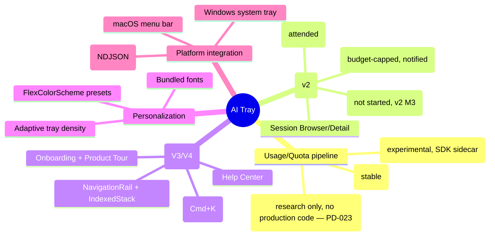

# Feature mindmap

## Bounded contexts

Usage/Quota and Session management are deliberately separate bounded
contexts: they share only `ClaudeSessionService` and `NotificationGateway`,
not state or a database. See `architecture` and [[usage-data-model]] /
[[caching-strategy]] for the pipeline, `flow` for the resume flow.
