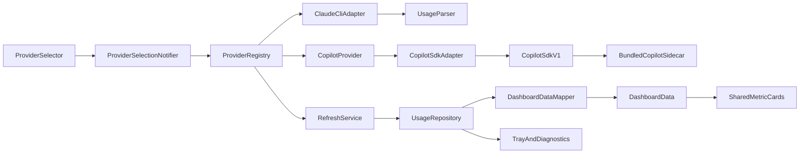

# Provider Platform Architecture

**Decision:** PD-021 Multi-Provider Architecture · EP-002 Copilot Integration
**Status:** Implemented (Claude + GitHub Copilot shared platform)
**Date:** 2026-07-18

## Architecture diagram



The registry is the only provider catalog. Shared presentation consumes provider
metadata, capabilities, `DashboardData`, and `ProviderStatus`. Provider-specific
branching is limited to experimental badges and empty-state recovery copy.

## Refactoring summary

### Provider contracts

- `AIProvider` extends the existing raw usage/health port with display metadata,
  capabilities, parser contract, availability, and provider-authored fallback
  copy.
- `ProviderRegistry` owns deterministic registration, enabled filtering,
  duplicate detection, default resolution, and disabled-provider rejection.
- `ProviderUsageParser` normalizes provider-specific payloads into
  `ProviderUsageCandidate`.
- `ProviderStatus` is the shared status model used beside normalized dashboard
  metrics.

### Claude migration

`ClaudeCliAdapter` now conforms to `AIProvider`. The implementation retains:

- `claude -p /usage --output-format json`
- `claude --version`
- `claude auth status --json`
- Existing Shape A / Shape B parsing
- Existing validation, retry, auth-probe, LKG cache, and scheduling behavior
- Existing `aiProviderPortProvider` and `usageRepositoryProvider` compatibility
  names

No Claude parser fixture or command contract changed.

### Capability-driven UI

`DashboardDataMapper` maps canonical usage into `DashboardMetric` values only
when declared by `ProviderCapabilities`. The dashboard loops over those metrics
using the shared `MetricCard`. Status, source labels, health visibility, settings
labels, diagnostics, tray labels, and empty-state copy use provider metadata.

The provider selector receives user-enabled registry providers. Copilot can be
enabled in Settings; selection persists across launches and triggers a
provider-scoped refresh.

## Updated folder structure

```text
lib/features/providers/
├── data/
│   ├── claude/
│   │   └── claude_cli_adapter.dart
│   ├── copilot/
│   │   ├── copilot_adapter.dart
│   │   ├── copilot_provider.dart
│   │   └── copilot_usage_parser.dart
│   └── process/
├── domain/
│   ├── models/
│   │   ├── provider_capabilities.dart
│   │   ├── provider_id.dart
│   │   ├── provider_status.dart
│   │   └── provider_usage_candidate.dart
│   ├── ports/
│   │   ├── ai_provider.dart
│   │   ├── ai_provider_port.dart
│   │   └── provider_usage_parser.dart
│   └── services/
│       └── provider_registry.dart
└── presentation/
    ├── provider_selection_controller.dart
    └── widgets/
        └── provider_selector.dart

lib/features/usage/domain/
├── models/
│   └── dashboard_data.dart
└── services/
    └── dashboard_data_mapper.dart
```

## Copilot integration and limitations

`CopilotProvider` is enabled through the shared framework and talks to the
official GitHub Copilot SDK via a bundled Node sidecar:

- Adapter owns lifecycle, timeouts, retries, logging, and DTO mapping
- Domain metrics are app-owned (`UsageInfo.metrics`) and SDK-free in UI
- Quota retrieval uses experimental `client.rpc.account.getQuota({})`
- Failures degrade to LKG cache / actionable empty states

Remaining limitations:

1. Quota RPC remains experimental and may change without notice.
2. Release artifacts currently publish macOS arm64 + Windows x64 only.
3. Auth depends on the GitHub identity available to the sidecar environment.

See [GitHub Copilot provider docs](../providers/github-copilot.md) and the
[EP-002 implementation report](../release/EP-002-implementation-report.md).

## Migration notes

### Current release

- Default and active provider remain `ProviderId.claude`.
- Existing settings key `settings_v1_claudeBinaryPath` remains unchanged.
- Existing Claude LKG key `usage_lkg_v1` remains unchanged.
- No user preference migration is required.
- No cache is cleared or rewritten.

### Activating a second provider

Before enabling Copilot or another provider:

1. Implement its adapter and parser with fixtures.
2. Declare only verified capabilities.
3. Add provider-scoped settings and cache keys.
4. Migrate `usage_lkg_v1` as Claude-only data without deleting it until a
   successful scoped write.
5. Persist active provider selection.
6. Partition refresh timers/status streams if simultaneous provider refresh is
   required.

The current phase deliberately keeps one active refresh loop to avoid changing
Claude scheduling or stale-cache behavior.

## Regression results

Executed from `ai_tray/` on 2026-07-16:

- `dart format lib test` — clean
- `flutter analyze --fatal-infos` — no issues
- `flutter test --exclude-tags golden,screenshot` — 75 passed
- `flutter test --tags golden` — 3 passed

Coverage added:

- Registry enabled filtering, duplicate rejection, and disabled lookup
- Provider selection validation
- Capability-filtered dashboard metrics
- Shared provider status mapping
- Copilot no-op adapter and parser scaffold
- Enabled-only provider selector rendering

Existing Claude adapter, parser, refresh, repository, cache, tray, stability,
smoke, theme, and golden tests remain passing.

