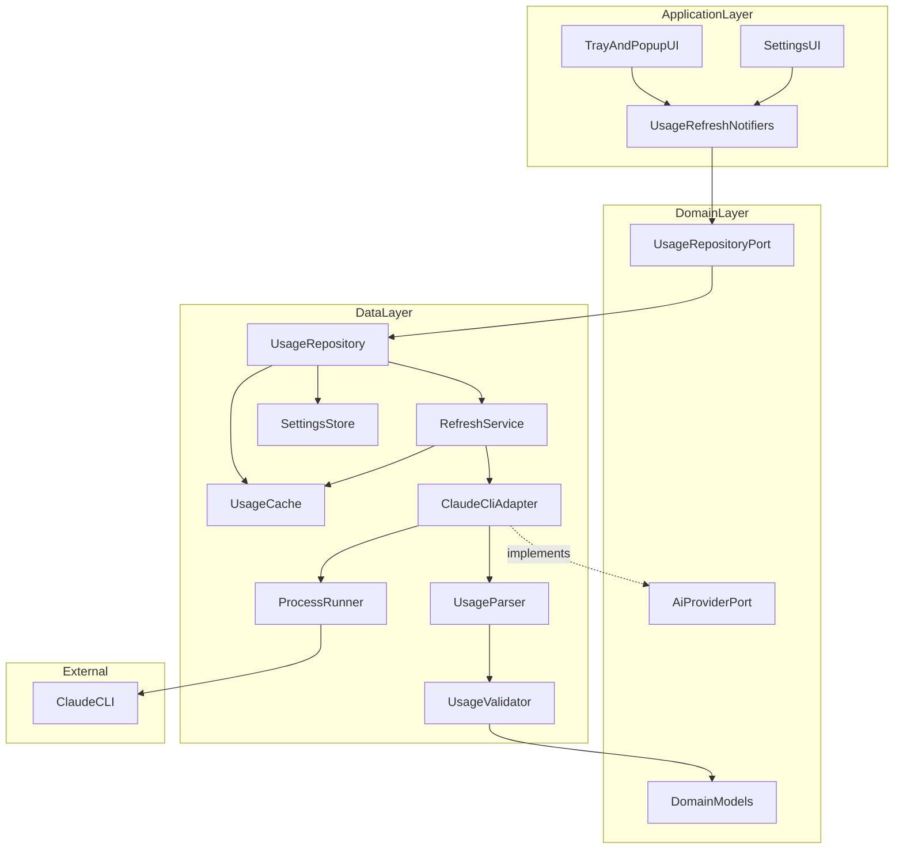

# System Architecture — MVP (Lightweight Planning)

**Phase:** Lightweight Planning · Task 0002  
**Scope:** Responsibilities and data flow only  
**Non-goals:** UI layouts, Flutter source, package selection finalization beyond conceptual roles

---

## Overview

AI Tray is a Flutter desktop companion that shows Claude Code subscription usage in the macOS menu bar / Windows tray. MVP data enters through a Claude CLI adapter, becomes domain models via parse + validate, and is served to the app through a repository with cache-aware refresh.



---

## Layers and components

### 1. Application layer

**Responsibility:** Present state, accept user intents (manual refresh, open settings, toggle notifications / launch-at-login), schedule UI updates from domain/repository results.

**Includes (conceptual):**

- Tray / menu bar shell
- Compact usage popup
- Settings surface
- Riverpod notifiers / controllers that call repository ports only

**Must not:** Spawn CLI processes, parse raw stdout, or know CLI flags.

---

### 2. Repository layer

**Component:** `UsageRepository` (implements domain `UsageRepositoryPort`)

**Responsibility:** Single entry point for usage reads and refresh orchestration.

- Load last-known-good usage for fast startup
- Trigger refresh via `RefreshService`
- Merge fresh / cached / error outcomes into a stable `RefreshResult`
- Expose settings-driven refresh interval to callers (or collaborate with refresh service)

**Must not:** Contain CLI argv details or regex parsing.

---

### 3. Claude Adapter

**Component:** `ClaudeCliAdapter` (implements `AiProviderPort` for Claude)

**Responsibility:** Translate domain “fetch usage” into a concrete CLI invocation and raw capture.

- Resolve `claude` binary path (PATH + optional settings override)
- Run `claude -p '/usage' --output-format json` non-interactively
- Capture stdout, stderr, exit code, duration
- Optionally run `claude auth status --json` for health checks
- Return a raw fetch DTO (envelope + text + diagnostics) to higher data components

**Must not:** Decide cache policy or map to UI models beyond provider-raw structures.

**Constraint from ADR-001:** Do not use `--bare` for usage polls.

---

### 4. Parser

**Component:** `UsageParser`

**Responsibility:** Convert free-text `/usage` `result` (and envelope metadata) into a candidate domain structure.

- Detect Shape A (rate limits present) vs Shape B (contribution-only)
- Extract session %, session reset, weekly buckets
- Preserve raw text for debugging / support

**Must not:** Persist data or perform network/process I/O.

---

### 5. Validator

**Component:** `UsageValidator`

**Responsibility:** Decide whether a parsed candidate is MVP-usable.

- Require rate-limit presence for a “fresh success”
- Bound percentages to 0–100
- Reject empty / malformed reset strings when rate limits claim to be present
- Classify outcome: `valid`, `incomplete` (Shape B), `invalid`

Emits / contributes to `ParserState` for observability.

---

### 6. Cache

**Component:** `UsageCache`

**Responsibility:** Persist and retrieve the last known-good `UsageInfo` (and metadata such as fetched-at).

- Serve cold start and Shape B soft failures
- Support “stale but displayable” UX
- Clear on logout / explicit reset (future-friendly)

Storage technology is deferred to a later ADR; role is durable local snapshot.

---

### 7. Settings

**Component:** `SettingsStore` + domain `AppSettings`

**Responsibility:** Persist user preferences that affect refresh and notifications.

MVP settings concepts:

- Auto-refresh enabled
- Refresh interval (within allowed range, e.g. 30–60s+)
- Notifications enabled / thresholds (e.g. warn at N%)
- Launch at login
- Optional CLI path override

**Must not:** Fetch usage itself.

---

### 8. Refresh Service

**Component:** `RefreshService`

**Responsibility:** Coordinate one refresh cycle and periodic auto-refresh.

- Enforce single-flight (no overlapping CLI processes)
- Apply timeout
- Call adapter → parser → validator
- On valid Shape A: write cache
- On Shape B / errors: keep prior cache, return typed failure/soft-failure
- Emit `RefreshStatus` transitions: idle → refreshing → success | softFailure | failure

Driven by settings interval + manual triggers from the application layer.

---

## Data flow

### Cold start

1. Application requests current usage
2. Repository reads `UsageCache`
3. If cache hit → return cached `UsageInfo` with `RefreshStatus.idle` / stale indicator
4. Repository kicks an initial refresh (non-blocking or awaited per UX policy)

### Manual or auto refresh

1. Application → Repository → RefreshService
2. RefreshService sets status `refreshing`
3. ClaudeCliAdapter spawns CLI and captures output
4. UsageParser produces candidate fields + shape
5. UsageValidator classifies result
6. **Valid Shape A:** map to `UsageInfo`, write cache, return `RefreshResult.success`
7. **Shape B / incomplete:** return `RefreshResult.softFailure` + cached `UsageInfo` if any
8. **Hard failure** (CLI missing, auth, timeout, parse invalid): return `RefreshResult.failure` + cached data if any
9. Application layer renders success / stale / error without knowing CLI details

### Settings change

1. Settings UI writes via SettingsStore
2. RefreshService reschedules timer if interval/auto-refresh changed
3. No CLI call unless user also refreshes

### Auth / CLI health (supporting flow)

1. On repeated failures or first launch, adapter/repository may check auth status
2. Failures surface as actionable errors (“Claude CLI not found”, “Not logged in”)

---

## Provider extensibility (MVP-ready, Claude-only)

```text
AiProviderPort
  └─ fetchUsageRaw() / getProviderId() / healthCheck()

ClaudeCliAdapter implements AiProviderPort
```

Future ChatGPT / Gemini / Cursor adapters plug in at this port. Repositories and UI remain provider-agnostic at the domain boundary.

---

## Error and soft-failure philosophy

| Outcome | Rate limits | Cache | User-facing intent |
|---------|-------------|-------|--------------------|
| Success | Present & valid | Update | Show fresh usage + reset |
| Soft failure | Missing (Shape B) | Keep | Show last known + “may be stale” |
| Failure | N/A | Keep if any | Show error + retry |

This directly encodes ADR-001 limitations into the architecture.

---

## Out of scope for this document

- Widget trees and visual design
- Exact package versions (`tray_manager`, Drift vs Hive, etc.)
- CI pipelines
- Analytics / multi-provider UI (post-MVP)
