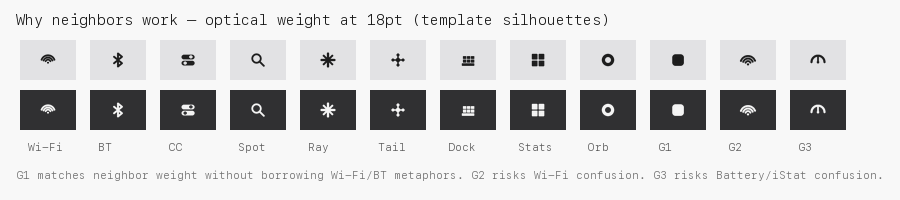
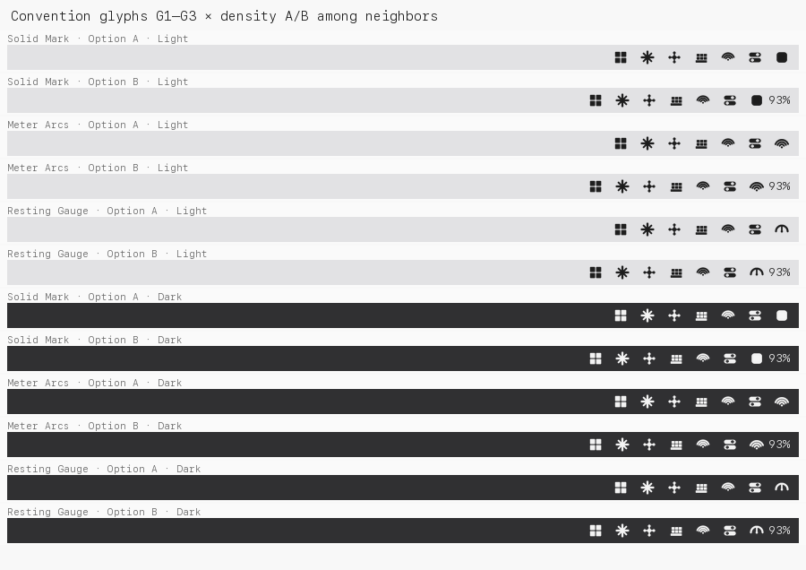
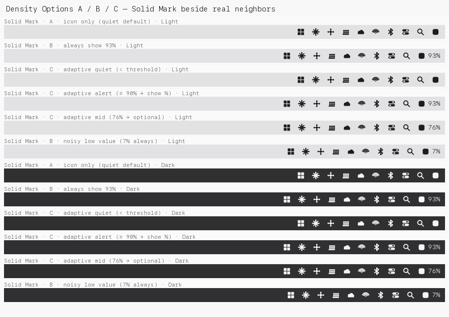
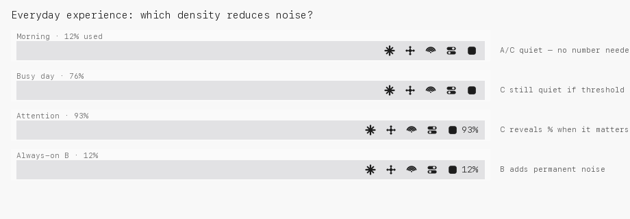

# Menu Bar — Exploration v3 (Benchmark + Density)

**Status:** Implemented (adaptive density + G1 template) — 2026-07-31  
**Date:** 2026-07-31  
**Shift:** Stop inventing metaphors. Benchmark real extras. Decide **density** before **glyph**.

Supersedes the “ship this clever mark” framing in
[MENU_BAR_ICON_CONCEPTS.md](MENU_BAR_ICON_CONCEPTS.md) /
[MENU_BAR_ICON_CONCEPTS_V2.md](MENU_BAR_ICON_CONCEPTS_V2.md).

**Shipped defaults:** Option C adaptive (≥ 90%), G1 solid template mark,
opacity pulse while refreshing, tooltip always carries full usage.

---

## Thesis

The menu bar is not a branding surface. Successful extras optimize for:

1. **Instant recognition** at ~16–18 pt among noisy neighbors  
2. **Stable optical weight** that matches system items  
3. **Quiet everyday presence** — information appears when useful  

Showing `93%` all day may be the larger UX mistake. A better icon cannot fix
permanent numeric noise.

---

## Benchmark: why known extras work

References: Apple HIG (menu bar extras), [Bjango — Designing macOS menu bar
extras](https://bjango.com/articles/designingmenubarextras/), and observed
behavior of Raycast, Tailscale, Docker Desktop, OrbStack, iStat Menus, Stats,
Hidden Bar, Dropbox, OneDrive, plus system Control Center / Wi-Fi / Bluetooth /
Spotlight.

### Shared mechanics

| Rule | Detail |
| --- | --- |
| Template images | Black + alpha only; `isTemplate = true`; system tints Light/Dark |
| Working height | ≤ 22 pt; Apple-sized extras often feel right near **16–18 pt** |
| State via alpha | Apple often uses **~35% opacity** for disabled / reduced state — not a second metaphor |
| No padding games | Optical centering by eye against neighbors |
| Prefer PDF/SVG or 1×/2× PNG | Crisp on Retina |

### Why each silhouette works

| Extra | Silhouette | Why it survives 18 pt |
| --- | --- | --- |
| Wi-Fi | Concentric arcs + dot | Familiar progressive form; strength = arc count / opacity |
| Bluetooth | Angular rune | Unique geometry; high contrast strokes |
| Control Center | Twin toggles | Two stacked capsules; bold fill + negative knobs |
| Spotlight | Magnifier | One ring + one handle; huge negative space in lens |
| Raycast | Starburst / logomark | Symmetrical, fill-heavy, no thin filigree |
| Tailscale | Hub + nodes | Simple graph; solid dots, short links |
| Docker | Block stack | Horizontal mass; container blocks read as “Docker” via repetition |
| OrbStack | Orb / ring | Circular mass matched to neighbors |
| Stats / iStat | Tiles / meters | Dense fills; charts only when that *is* the product |
| Hidden Bar | Chevron | Single bold stroke; means “collapse” |
| Dropbox | Open diamonds | Faceted but still one silhouette |
| OneDrive | Cloud | Soft blob; unmistakable category |

### Extracted principles (for AI Tray)

1. **Borrow structure, not product metaphors** — weight and simplicity of CC / Stats / Raycast; do not invent “chips” or “ribbons.”  
2. **One silhouette** — no multi-part illustrations.  
3. **Fill over outline** — thin rings die at 16 pt and fight template tinting.  
4. **Don’t collide with system grammar** — avoid Wi-Fi arcs, BT runes, battery gauges, sync arrows, shields.  
5. **State is subtle** — opacity, a small gap, or title text — not a new icon language.  
6. **Text is optional** — many best-in-class extras are **icon-only**; numbers appear in the menu or on demand (iStat/Stats are the exception *because metering is the product*, and even they let you choose what is always visible).



---

## Glyph redesign (convention-based, not branded)

Only three candidates, chosen to match neighbor weight:

| ID | Form | Intent | Risk |
| --- | --- | --- | --- |
| **G1 Solid Mark** | Filled rounded square (squircle) | Same optical family as CC / Stats tiles | Generic until learned — acceptable for utilities |
| G2 Meter Arcs | Concentric arcs | Familiar “meter” grammar | **Collides with Wi-Fi** |
| G3 Resting Gauge | Semicircle + needle | Familiar “gauge” grammar | **Collides with Battery / iStat** |

**Glyph recommendation: G1 Solid Mark.**

- Matches neighbor ink without stealing Wi-Fi / BT / Battery / sync.  
- Template-friendly solid alpha.  
- Idle → full opacity; refreshing / unavailable → ~35% opacity (Apple pattern).  
- Not a logo. Not a metaphor. A calm presence the user learns once.

G2 and G3 are documented as traps — familiar *categories*, wrong *neighbors*.



---

## Information density (the real decision)

### Option A — Minimal

```text
[icon]
```

- Fastest scan; least menu-bar width.  
- Usage lives in the dropdown / window / tooltip.  
- Best default for users who open the menu when they care.

### Option B — Current (always percent)

```text
[icon] 93%
```

- Glanceable absolute value.  
- Permanent width + permanent noise (`12%` is rarely actionable).  
- Competes with Clock / Focus / other titles.  
- Doubles information if the icon also tries to encode usage.

### Option C — Adaptive

```text
[icon]           # normal
[icon] 93%       # only when useful
```

Show the percentage when **any** of:

| Trigger | Rationale |
| --- | --- |
| Usage ≥ configurable threshold (defaults e.g. 75 / 90 / 95) | Attention when scarce |
| Refreshing / error / stale | Status needs a second channel |
| Active session (optional) | Session burn is time-sensitive |
| Hover | **Limited** — see feasibility note |

Hide the percentage otherwise. Tooltip can always include the latest known %.





### Hover feasibility

| Mechanism | Feasible with current stack? |
| --- | --- |
| Tooltip with `%` on hover | Yes (`setToolTip`) |
| Title that appears only while hovering | **Not practical** with stock `tray_manager` / `NSStatusItem` image+title without a custom status-item view |
| Threshold / state-driven `setTitle` | Yes — preferred adaptive path |

Do not block the density model on hover-only titles.

---

## Comparison in a realistic cluster

Mock neighbors (simplified templates): Stats, Raycast, Tailscale, Docker,
OneDrive, Wi-Fi, Bluetooth, Control Center, Spotlight — with AI Tray at the
trailing edge (typical third-party placement).

| Density | Readability | Stability | macOS convention | Everyday noise |
| --- | --- | --- | --- | --- |
| A icon-only | High (icon hunt) | Highest | Matches Raycast / Tailscale / Docker / Dropbox default | Lowest |
| B always `%` | High for number | Width jumps with `7%` vs `100%` | Matches “meter apps” that choose always-on | Highest |
| **C adaptive** | High when it matters | Stable most of the day | Matches how Battery / Focus reveal urgency | Low |

---

## Final recommendation

### 1. Density: **Option C (adaptive)** as the product default

- Default thresholds: show title at **≥ 90%** (warning) and always on **error / refreshing**; optional user setting for 75 / 90 / 95 / always / never.  
- Tooltip always carries the latest `%` + provider.  
- Drop emoji prefixes in the title (non-native).  

**Option A** remains a supported “Never show % in menu bar” preference.  
**Option B** remains “Always show %” for users who want iStat-like permanence.

This is the highest-leverage change — larger than picking among abstract marks.

### 2. Glyph: **G1 Solid Mark** (filled rounded square)

- 18×18 pt template (1×/2× or PDF), `isTemplate: true`.  
- Optical weight tuned against Control Center / Stats, not against a dock icon.  
- Refreshing = 35% opacity (or a very short indeterminate pulse), not a new shape language.

### 3. Explicitly reject (for now)

- Metaphor marks (chip, ribbon, bowtie, spark-as-brand).  
- G2 arcs (Wi-Fi collision).  
- G3 gauge (Battery/iStat collision).  
- Always-on orange usage rings beside a title percentage.  
- Hover-only title as a required dependency.

### 4. Still no production swap in this exploration

Confirm:

1. Adaptive density (C) as default — yes/no?  
2. Threshold defaults (90% / configurable) — yes/no?  
3. G1 Solid Mark vs keep exploring only among **convention** glyphs (not metaphors)?

---

## Assets

| File | Path |
| --- | --- |
| Neighbor optical weight | [`v3/previews/optical_weight_neighbors.png`](assets/menu-bar-icon-concepts/v3/previews/optical_weight_neighbors.png) |
| Density A/B/C | [`v3/previews/density_abc_solid_mark.png`](assets/menu-bar-icon-concepts/v3/previews/density_abc_solid_mark.png) |
| Everyday story | [`v3/previews/everyday_density_story.png`](assets/menu-bar-icon-concepts/v3/previews/everyday_density_story.png) |
| G1–G3 in bar | [`v3/previews/glyphs_g1_g3_in_bar.png`](assets/menu-bar-icon-concepts/v3/previews/glyphs_g1_g3_in_bar.png) |
| G1 states | [`v3/previews/g1_states.png`](assets/menu-bar-icon-concepts/v3/previews/g1_states.png) |
| Masters | [`v3/masters/`](assets/menu-bar-icon-concepts/v3/masters/) |
