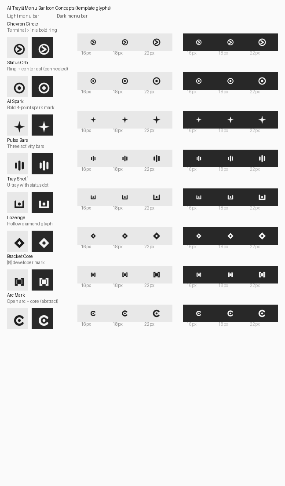
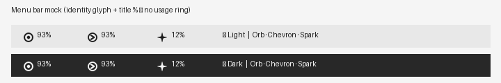

# Menu Bar Icon Concepts

**Status:** Design exploration — awaiting selection before implementation  
**Date:** 2026-07-31  
**Scope:** macOS menu-bar template glyph only (not the Dock / app icon)

## Problem

The live menu bar currently pairs a weak/non-distinct template asset with a
title that already shows usage (e.g. `93%`). Encoding usage again as a colored
ring duplicates information, fights native menu-bar chrome, and fails the 16–18
px readability test used by Raycast, Stats, OrbStack, Docker Desktop, Tailscale,
and Warp.

## Design principle (locked for this exploration)

| Channel | Role |
| --- | --- |
| **Icon** | App identity + connection/activity status (monochrome template) |
| **Title text** | Usage (`93%`, `12%`) |
| **Color** | Attention only (warning / critical) — not day-to-day usage |

This supersedes the older “tray ring encodes usage alone” line in
`DESIGN_SYSTEM.md` for the **menu bar item**. In-app `ProgressRing` widgets
remain the place for band-colored usage visualization.

## Constraints

- Monochrome black silhouette + transparency → `isTemplate: true`
- Bold, symmetrical, single connected silhouette preferred
- Readable at 16×16; comfortable at 18 / 22
- No gradients, text, thin outlines, or disconnected particles
- Two states: **Idle / Connected** and **Refreshing** (subtle motion)

## Assets

| Preview | Path |
| --- | --- |
| Full comparison (16 / 18 / 22 × Light / Dark) | [`assets/menu-bar-icon-concepts/previews/comparison_sheet.png`](assets/menu-bar-icon-concepts/previews/comparison_sheet.png) |
| Top-3 menu-bar mock | [`assets/menu-bar-icon-concepts/previews/menubar_mock_top3.png`](assets/menu-bar-icon-concepts/previews/menubar_mock_top3.png) |
| Refreshing variants | [`assets/menu-bar-icon-concepts/previews/refreshing_states.png`](assets/menu-bar-icon-concepts/previews/refreshing_states.png) |
| Masters (128 px templates) | [`assets/menu-bar-icon-concepts/masters/`](assets/menu-bar-icon-concepts/masters/) |

---

## Concepts

### 1. Chevron Circle

Terminal `>` inside a bold ring.

| | |
| --- | --- |
| **Strengths** | Instant “CLI / developer tool” read; strong silhouette; refreshing = slight rotation feels natural |
| **Weaknesses** | Slightly asymmetric (chevron direction); may feel Warp-adjacent |
| **16 px** | Excellent |
| **Refreshing** | Rotate glyph ~15–20° or spin the ring |

### 2. Status Orb — **recommended**

Thick ring + solid center dot (identity, not a usage meter).

| | |
| --- | --- |
| **Strengths** | Maximum symmetry; “connected” reads instantly; matches Stats / Tailscale simplicity; refresh = incomplete spinner arc or center-dot pulse without changing identity |
| **Weaknesses** | More generic than a chevron; must stay thick so it never looks like a usage pie |
| **16 px** | Excellent |
| **Refreshing** | Open arc spinner around the same center dot |

### 3. AI Spark

Bold 4-point spark.

| | |
| --- | --- |
| **Strengths** | Communicates “AI” without provider branding; single shape |
| **Weaknesses** | Common AI cliché; sharp points can mush at 16 px; less “tray utility” and more “magic button” |
| **16 px** | Good if stroke weight stays high |
| **Refreshing** | Opacity / scale pulse |

### 4. Pulse Bars

Three vertical activity bars.

| | |
| --- | --- |
| **Strengths** | Familiar activity metaphor (Stats / audio); refreshing animation is obvious |
| **Weaknesses** | Asymmetric heights imply “levels” (easy to confuse with usage); wider footprint |
| **16 px** | Good |
| **Refreshing** | Sequential bar pulse |

### 5. Tray Shelf

U-shaped tray with a center status dot.

| | |
| --- | --- |
| **Strengths** | Literally “tray”; unique product metaphor |
| **Weaknesses** | More detail; open top reduces optical weight; weaker at 16 px than orb/chevron |
| **16 px** | Fair–good |
| **Refreshing** | Dot pulse |

### 6. Lozenge

Hollow diamond.

| | |
| --- | --- |
| **Strengths** | Pure geometry; premium and calm; OrbStack-simple |
| **Weaknesses** | Weak semantic link to AI/Claude/usage; easy to confuse with other utilities |
| **16 px** | Excellent |
| **Refreshing** | Rotate 45° ↔ 0° or pulse stroke |

### 7. Bracket Core

`[■]` developer mark.

| | |
| --- | --- |
| **Strengths** | Strong “code tool” identity; horizontal rhythm fits menu titles |
| **Weaknesses** | Multiple sub-shapes risk mud at 16 px; less symmetrical |
| **16 px** | Fair |
| **Refreshing** | Core blink / opacity |

### 8. Arc Mark

Open C-like arc + center core (abstract; not Claude branding).

| | |
| --- | --- |
| **Strengths** | Distinctive silhouette; implies “provider / session” without copying marks |
| **Weaknesses** | Opening side adds asymmetry; may read as a broken ring or progress arc |
| **16 px** | Good |
| **Refreshing** | Rotate the open gap |

---

## Scoring (design review)

Criteria weighted for menu-bar reality: **16 px legibility (3)**, **identity without usage (3)**,
**native premium feel (2)**, **refresh motion clarity (1)**, **symmetry (1)**.

| Concept | Score | Notes |
| --- | --- | --- |
| Status Orb | **9.5** | Best balance of native calm + status |
| Chevron Circle | **9.0** | Best “developer product” signal |
| Lozenge | **7.5** | Beautiful but low meaning |
| AI Spark | **7.0** | Clear AI, slightly cliché |
| Arc Mark | **7.0** | Distinctive; risk of progress misread |
| Pulse Bars | **6.5** | Animation-friendly; usage confusion risk |
| Tray Shelf | **6.0** | On-brand name; weaker micro-size |
| Bracket Core | **5.5** | Clever; densest at 16 px |

---

## Recommendation

**Ship Status Orb (concept 2)** as the default macOS menu-bar template.

### Why

1. **Separation of concerns:** Icon = identity/status; title = `93%`; color only for
   warning/critical — matches premium menu-bar utilities and the observation that a
   usage ring doubles the percentage text.
2. **Native template behavior:** Single thick ring + dot remains crisp when macOS
   tints the template in Light and Dark menu bars.
3. **Refreshing state:** Swap to an open spinner arc around the same center dot —
   recognizable motion without a second metaphor.
4. **Room to evolve:** Chevron Circle is the strongest alternate if dogfood finds
   Orb too generic; both share the same template pipeline.

### Explicitly not recommended for the menu bar

- **Usage-progress rings / orange arcs** beside a `%` title (double encoding).
- **Colorful status PNGs** as the live glyph (breaks `isTemplate` Light/Dark).
- **App icon / mascot miniatures** (fail at 16 px).

### Implementation sketch (after approval)

1. Export Orb masters → `assets/tray/tray_menubar_template.png` (@1x/@2x sizes as needed).
2. Add `tray_menubar_template_refreshing.png` (open arc).
3. Keep `trayManager.setIcon(..., isTemplate: true)`.
4. Title remains percentage (drop emoji noise if still present).
5. Optional later: tinted non-template icon **only** for warning/critical bands.
6. Update `DESIGN_SYSTEM.md` “Tray indicator” section to match this model.
7. Wire idle ↔ refreshing swap in `TrayController` when `TrayStatusKind.refreshing`.

---

## Decision needed

Please pick one:

1. **Status Orb** (recommended)
2. **Chevron Circle** (strong alternate)
3. Another concept from the sheet
4. Request a hybrid (e.g. Orb idle + Chevron only in docs/marketing)

No production assets will replace the live tray icon until you confirm.
