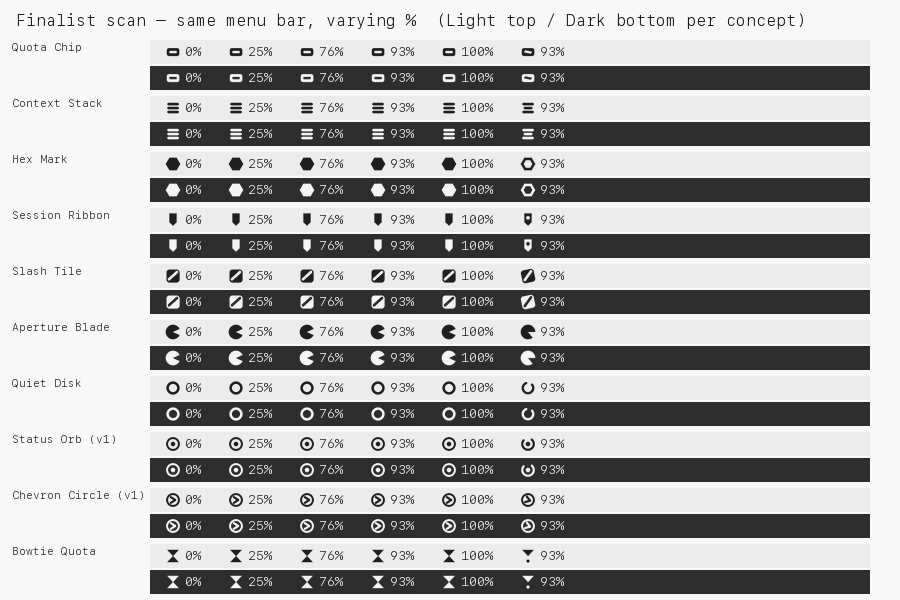
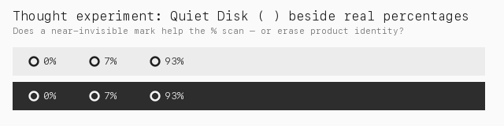

# Menu Bar Icon Concepts — Exploration v2

**Status:** Design exploration — no production assets yet  
**Date:** 2026-07-31  
**Focus:** Real menu-bar context `[icon] 93%` (not isolated glyphs)

Companion to [MENU_BAR_ICON_CONCEPTS.md](MENU_BAR_ICON_CONCEPTS.md) (v1).

---

## The `⚪` thought

```text
⚪ 93%
⚪ 7%
⚪ 0%
```

This is the correct **evaluation frame**, not necessarily the correct **glyph**.

| What works | What fails |
| --- | --- |
| Icon stays constant while % changes | Hollow disk has almost no product identity |
| Optical weight below the numerals | Reads as status light / recording / sync seed |
| Easy Light/Dark template tint | Refreshing broken-ring looks like a system spinner |

**Lesson:** Aim for *Quiet Disk calm* with a silhouette you could still pick out among other menu-bar utilities.

---

## Evaluation method (changed from v1)

Every concept is judged **in situ**:

```text
[icon] 0%
[icon] 25%
[icon] 76%
[icon] 93%
[icon] 100%
```

At **16 / 18 / 22 px**, **Light and Dark**, **idle and refreshing**.

Criteria (weighted):

1. Does not compete with the percentage (3)
2. Distinct identity vs Warp / Terminal / Docker / Activity Monitor / VPN / sync (3)
3. Recognizable at 18 px beside SF-like numerals (2)
4. Refreshing state without a new metaphor (1)
5. Template-friendly solid silhouette (1)

---

## Assets

| Preview | Path |
| --- | --- |
| All concepts × all % (18 px, L/D, idle/refresh) | [`assets/menu-bar-icon-concepts/v2/previews/context_18px_all_percents.png`](assets/menu-bar-icon-concepts/v2/previews/context_18px_all_percents.png) |
| Size matrix @ 93% (16/18/22 × L/D) | [`assets/menu-bar-icon-concepts/v2/previews/size_matrix_93.png`](assets/menu-bar-icon-concepts/v2/previews/size_matrix_93.png) |
| Fake menu-bar strips @ 93% | [`assets/menu-bar-icon-concepts/v2/previews/menubar_strips_93.png`](assets/menu-bar-icon-concepts/v2/previews/menubar_strips_93.png) |
| Finalist scan | [`assets/menu-bar-icon-concepts/v2/previews/finalist_scan.png`](assets/menu-bar-icon-concepts/v2/previews/finalist_scan.png) |
| Quiet Disk thought | [`assets/menu-bar-icon-concepts/v2/previews/thought_quiet_disk.png`](assets/menu-bar-icon-concepts/v2/previews/thought_quiet_disk.png) |
| Masters | [`assets/menu-bar-icon-concepts/v2/masters/`](assets/menu-bar-icon-concepts/v2/masters/) |





---

## Concepts in this round

### Baselines (re-scored in context)

| ID | Name | In-context read |
| --- | --- | --- |
| b01 | Status Orb (v1) | Calm, but generic “connected” orb — easy to lose among VPN/status apps |
| b02 | Chevron Circle (v1) | Too close to Warp / Terminal prompt |

### New silhouettes

| ID | Name | Silhouette | Avoids |
| --- | --- | --- | --- |
| c01 | Quiet Disk | Hollow disk (⚪) | — (control for the thought experiment) |
| c02 | **Quota Chip** | Rounded chip + slot | Rings, chevrons, bars, shields |
| c03 | Context Stack | Three equal slabs | Signal bars (equal weight) |
| c04 | Hex Mark | Solid hexagon | Circles / rings |
| c05 | Session Ribbon | Bookmark flag | Circles / prompts |
| c06 | Slash Tile | Rounded square + slash | Chevrons / rings |
| c07 | Bowtie Quota | Hourglass | — (risks “wait” cursor) |
| c08 | Aperture Blade | 3/4 disk | — (reads as pie/progress next to %) |
| c09 | Twin Nodes | Linked pair | — (network / VPN-adjacent) |
| c10 | Folded Ticket | Dog-ear ticket | Circles |
| c11 | Quota Wave | Single sine | — (Activity Monitor / audio) |

---

## Per-concept notes (menu-bar context)

### Quiet Disk (⚪)

- **Strength:** Best non-competition with `93%`. Matches the thought experiment.
- **Weakness:** Zero brand. Refreshing gap = sync spinner.
- **Verdict:** Keep as a **design principle**, not the mark.

### Quota Chip — **recommended**

- **Strength:** Horizontal chip sits like a quiet prefix to tabular `%`. Slot = “credit / quota” without encoding the number. Unique vs the forbidden set. Refresh = tilt/shift the slot (same silhouette family).
- **Weakness:** Less “iconic logo” than a hex; must keep slot bold enough at 16 px.
- **16–22 px:** Excellent beside all of `0%` … `100%`.

### Session Ribbon — runner-up

- **Strength:** Vertical mass contrasts the horizontal numerals → easy to spot. Session/bookmark metaphor fits Claude sessions.
- **Weakness:** Slightly louder than Chip; notch detail needs care at 16 px.
- **Refreshing:** Punch a hole / bob — still a ribbon.

### Hex Mark

- **Strength:** Strongest pure silhouette; instantly “a mark.”
- **Weakness:** Solid fill can rival the weight of `100%`; less semantic link to usage.
- **Refreshing:** Hollow hex works but is a bigger state jump.

### Slash Tile

- **Strength:** Distinct tile; not a circle.
- **Weakness:** Diagonal can read as “blocked / ban” at a glance.

### Context Stack

- **Strength:** Calm, layered “context.”
- **Weakness:** Still close to list / hamburger / monitor metaphors.

### Aperture / Bowtie / Wave / Twin / Folded

- Parked: progress misread, wait-cursor, audio bars, VPN link, or document-generic.

### Orb / Chevron (v1)

- Demoted in real `[icon] NN%` scanning. Orb is Quiet Disk with a dot (still generic). Chevron fails the Warp/Terminal avoidance test.

---

## Scoreboard (in-context)

| Concept | Score | Compete w/ %? | Identity | Verdict |
| --- | --- | --- | --- | --- |
| Quota Chip | **9.2** | Low | High (quota) | **Ship candidate** |
| Session Ribbon | **8.6** | Low–med | High | Strong alternate |
| Hex Mark | **8.0** | Med | High | Alternate if you want max silhouette |
| Quiet Disk | **6.5** | Lowest | None | Principle only |
| Slash Tile | **6.4** | Low | Med | Park |
| Context Stack | **6.0** | Low | Med–low | Park |
| Folded Ticket | **5.8** | Low | Med | Park |
| Status Orb (v1) | **5.5** | Low | Low | Demote |
| Chevron Circle (v1) | **4.5** | Low | High but wrong | Reject (Warp/Terminal) |
| Twin Nodes | **4.5** | Low | Med | Reject (VPN-ish) |
| Bowtie Quota | **4.0** | Med | Med | Reject (wait) |
| Quota Wave | **3.5** | Med | Low | Reject (monitor) |
| Aperture Blade | **3.0** | High | Med | Reject (pie vs %) |

---

## Recommendation

**Primary: Quota Chip**

```text
[chip] 0%
[chip] 25%
[chip] 76%
[chip] 93%
[chip] 100%
```

Why this wins the `⚪` test without *being* ⚪:

1. Stays quiet next to percentages (horizontal, medium weight).
2. Has a product story (quota / credit) AI Tray can own.
3. Does not look like Warp, Terminal, Docker, Activity Monitor, VPN, or sync.
4. Refreshing can reuse the same chip with a moving/angled slot — no spinner ring.

**Alternate:** Session Ribbon — if dogfood wants a more “flag-like” spottable mark.

**Do not ship:** Quiet Disk, Orb, Chevron, Aperture as the live glyph.

### Still not implementing

Confirm **Chip**, **Ribbon**, **Hex**, or request another round before any
`assets/tray/tray_menubar_template*.png` replacement.
