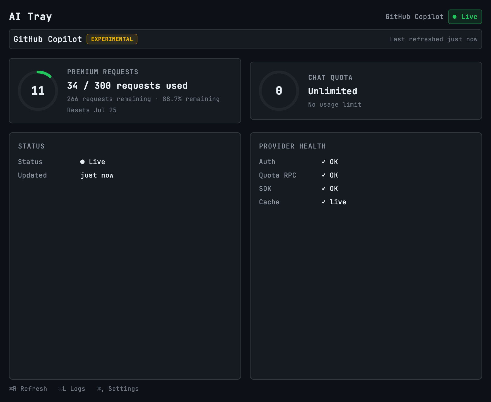
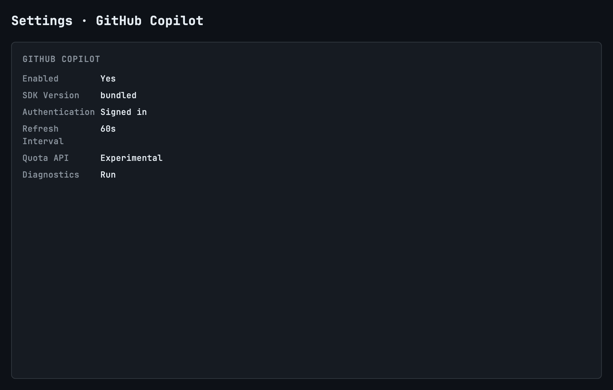
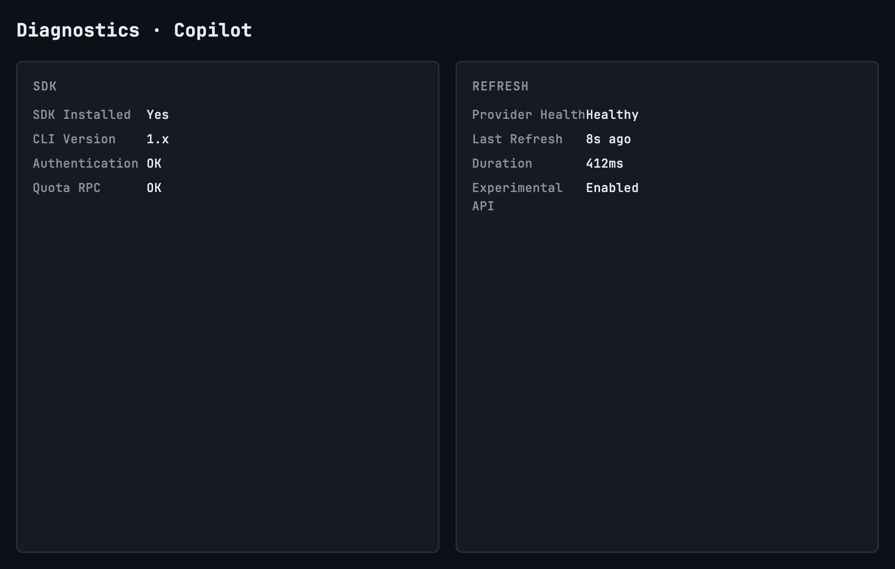
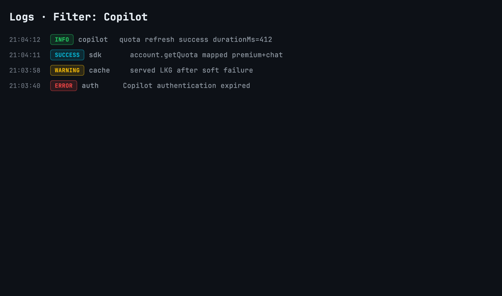

# GitHub Copilot Provider

**Epic:** EP-002  
**Status:** Implemented (UI integrated; quota API experimental)  
**Latest release covering this work:** [v1.3.3](https://github.com/roshandroids/AI_Tray/releases/tag/v1.3.3)

## Overview

AI Tray presents Claude Code and GitHub Copilot through one shared desktop
experience. Selecting Copilot refreshes the same dashboard, settings,
diagnostics, and logs surfaces used by Claude. Only the metrics and status
fields change.

Copilot quota retrieval uses the official `@github/copilot-sdk` through a
bundled Node sidecar:

```text
UI → Provider Registry → CopilotProvider → CopilotSdkAdapter
  → CopilotSdk / CopilotSdkV1 → Official GitHub Copilot SDK
```

The experimental RPC used for quota is:

```ts
client.rpc.account.getQuota({})
```

## Unified UX

| Surface | Copilot behavior |
| --- | --- |
| Provider selector | Persistable Claude / Copilot choice with race-safe refresh |
| Dashboard | Capability-driven cards: premium requests, remaining %, reset, chat/completions |
| Provider header | Name, experimental badge, health, last refresh |
| Circular ring | Threshold colors, refreshing animation, unavailable `--` |
| Settings | Enablement, auth/SDK status, refresh interval, diagnostics entry |
| Diagnostics | SDK/CLI versions, auth, quota RPC, health, timings, warnings |
| Logs | Filterable by provider (`All` / `Claude` / `GitHub Copilot`) |
| Empty states | Disabled, SDK missing, unauthenticated, quota/experimental unavailable |

## Screenshots









## Authentication

Copilot uses the authenticated GitHub identity available to the bundled SDK /
CLI environment. AI Tray does not scrape interactive terminal output and does
not call `/copilot_internal/*`.

If authentication fails, the shared empty state asks the user to sign in and
retry Refresh. Diagnostics shows auth and quota RPC status without secrets.

## Known limitations

1. **`account.getQuota` is experimental.** Schema or availability can change
   without a stable public contract.
2. **Graceful degradation is required.** Soft/hard failures keep last-known-good
   cache when available and never invent percentages.
3. **Release artifacts:** published desktop packages currently include
   **macOS arm64** and **Windows x64**. macOS Intel/x64 release builds are not
   published.
4. **Sidecar packaging** is required for release builds; debug workflows may
   assemble local payloads separately.

## Troubleshooting

| Symptom | Check |
| --- | --- |
| Provider missing from selector | Enable GitHub Copilot in Settings |
| `Authentication expired` | Sign in to GitHub Copilot, then Refresh |
| `Copilot SDK is missing` | Reinstall/update AI Tray; verify Diagnostics SDK/CLI rows |
| `Experimental API unavailable` | Update Copilot / AI Tray; retry later |
| Quota unavailable with cached cards | Open Diagnostics → Quota RPC; Refresh |

## Compatibility

- Shares the provider framework, dashboard mapper, metric cards, and tray shell
  with Claude.
- Claude CLI parsing and refresh behavior remain unchanged when Claude is
  selected.
- See [provider platform architecture](../architecture/provider-platform.md)
  and the [EP-002 implementation report](../release/EP-002-implementation-report.md).
