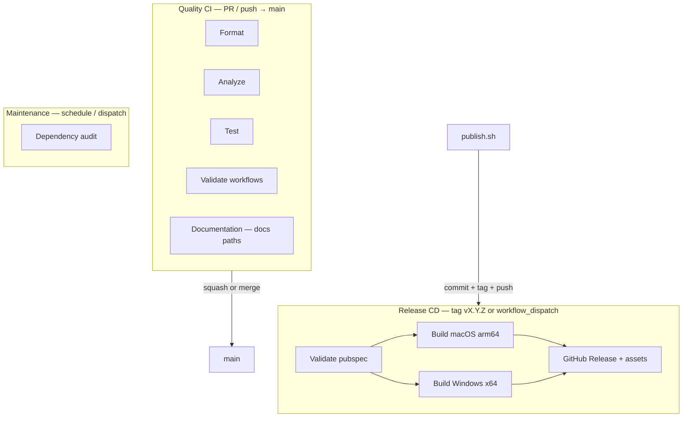

# CI/CD & Release Automation

Foundation for continuous integration and desktop release automation for AI Tray
(PD-016, evolved by **EP-004A** into **Quality CI + Release CD**).

**Model:**

| Lane | When | Runners | What |
|------|------|---------|------|
| **Quality CI** | `pull_request` / `push` → `main` | **Ubuntu only** | Format, Analyze, Test, Validate workflows |
| **Documentation** | Docs / markdown / showcase path changes | **Ubuntu only** | Handoff JSON, relative links (no Flutter) |
| **Release CD** | SemVer tag `vX.Y.Z` / `workflow_dispatch` | Ubuntu + **macOS** + **Windows** | Desktop builds, zip, GitHub Release assets |
| **Maintenance** | Weekly cron + dispatch | **Ubuntu only** | Outdated package reports (never builds app) |

**Hard rules:**
- macOS / Windows runners **never** run on `pull_request` or branch `push`.
- Desktop binaries are built **only** in [`release.yml`](../../.github/workflows/release.yml).
- Quality CI must stay fast (target wall-clock &lt;10 minutes).

**Out of scope:** Code signing, notarization, Sparkle auto-update, security scanning
(future `security.yml` placeholder only — do not invent scanners without evidence).
**Not published:** macOS Intel / x64 artifacts (D-007). Linux desktop not shipped.

Aligned with house conventions from **CELPIP** (job naming, Flutter pin, concurrency)
and **MBO Research** (CHANGELOG-as-release-notes, SemVer on pubspec, tag `vX.Y.Z`).

Local validation: [docs/devops/LOCAL_DEVELOPMENT.md](../devops/LOCAL_DEVELOPMENT.md).  
Demo / Showcase policy: [docs/devops/DEMO_STRATEGY.md](../devops/DEMO_STRATEGY.md).

---

## Pipeline overview



| Workflow | File | Trigger | Purpose |
|----------|------|---------|---------|
| **Quality** | [`.github/workflows/quality.yml`](../../.github/workflows/quality.yml) | PR + push → `main` | Format / Analyze / Test / workflow YAML — **no desktop** |
| **Documentation** | [`.github/workflows/documentation.yml`](../../.github/workflows/documentation.yml) | Docs / showcase / `*.md` paths | Handoff + JSON + relative links |
| **Release** | [`.github/workflows/release.yml`](../../.github/workflows/release.yml) | Tag `v*.*.*` or dispatch | **Only** desktop builds + GitHub Release |
| **Maintenance** | [`.github/workflows/maintenance.yml`](../../.github/workflows/maintenance.yml) | Weekly + dispatch | Safe outdated reports |
| **Reusable Flutter Web Demo** | [`.github/workflows/reusable-flutter-web-demo.yml`](../../.github/workflows/reusable-flutter-web-demo.yml) | `workflow_call` only | Template for other RSProjects — **not invoked by AI Tray** |

**Flutter:** `3.38.9` (stable) · **App directory:** `ai_tray/`

**Removed:** `.github/workflows/ci.yml` (replaced by Quality; PR macOS build deleted).

**Demos:** AI Tray is a product repository — the desktop app is the demo
([`showcase/demos.json`](../../showcase/demos.json) `id: main`, `type: desktop`).
No Flutter Web playground. See [DEMO_STRATEGY.md](../devops/DEMO_STRATEGY.md).

---

## Comparison with existing repositories

| Aspect | CELPIP | MBO Research | AI Tray (this repo) |
|--------|--------|--------------|---------------------|
| Quality workflow | `CI` | `ci` | `Quality` (`quality.yml`) |
| Job names (branch protection) | Format, Analyze, Test, Build Web | Analyze, Format, Test, Corpus | Format, Analyze, Test, Validate workflows |
| Flutter pin | `3.38.9` env | `3.38.9` inline | `3.38.9` env |
| `subosito/flutter-action@v2` + cache | Yes | Yes | Yes (+ `pub-cache-key` from `pubspec.lock`) |
| Concurrency cancel-in-progress | Yes | No | Yes (Quality / Docs / Maintenance) |
| Deploy on merge | Firebase Hosting | N/A | GitHub Release on **tag or dispatch only** |
| Desktop on PR | N/A (web) | N/A | **No** (Quality CI + Release CD / D-017) |

---

## Pull request CI (Quality)

**Required checks (configure in branch protection):**

| Check name | Command / behavior |
|------------|--------------------|
| `Format` | `dart format --set-exit-if-changed .` (skipped no-op if no code paths) |
| `Analyze` | `flutter analyze --fatal-infos` |
| `Test` | Bridge `npm run check` + `flutter test --exclude-tags golden,screenshot` |
| `Validate workflows` | Ruby YAML parse of `.github/workflows/*.yml` |

**Do not require:** `Build macOS` (removed), Release, Maintenance.

Run locally before opening a PR (or enable Lefthook — see Local Development):

```bash
cd ai_tray
flutter pub get
dart format --set-exit-if-changed .
flutter analyze --fatal-infos
flutter test --exclude-tags golden,screenshot
cd tool/copilot_sdk_bridge && npm run check
```

Desktop builds are **release-only**. Do not expect a PR macOS binary.

---

## Main branch

On push to `main`, Quality re-runs the same lightweight jobs (with path-aware
Flutter skips). No desktop artifacts. User-facing packages come only from **Release**.

---

## Documentation workflow

Triggers on `docs/**`, root `*.md`, `CHANGELOG.md`, `AI_Tray_*.md`, and the
documentation workflow file. Validates:

- `scripts/ci/validate_handoff.sh`
- `docs/project/*.json` parse
- Relative markdown links under `docs/project`, `docs/devops`, `docs/adr`

No Flutter SDK install.

---

## Release flow

### Automated path — “Publish AI Tray”

1. Add notes under `## [Unreleased]` in [`CHANGELOG.md`](../../CHANGELOG.md).
2. Ensure Quality is green on `main`.
3. Run from repo root:

```bash
./scripts/release/publish.sh patch    # 1.0.0 → 1.0.1
./scripts/release/publish.sh minor    # 1.0.0 → 1.1.0
./scripts/release/publish.sh major    # 1.0.0 → 2.0.0
./scripts/release/publish.sh 1.0.0    # pin exact version (e.g. GA from RC)
./scripts/release/publish.sh patch --pre rc.1   # pre-release
./scripts/release/publish.sh patch --dry-run    # preview only
```

4. Script actions:
   - Bumps `ai_tray/pubspec.yaml` (single source of truth)
   - Moves `[Unreleased]` → `[X.Y.Z] — date` in CHANGELOG
   - Commits, creates annotated tag `vX.Y.Z`, pushes commit + tag
5. **Release** workflow triggers automatically:
   - Validates tag ↔ pubspec
   - Builds and packages:
     - `AI-Tray-macOS-arm64.zip`
     - `AI-Tray-Windows-x64.zip`
   - Creates GitHub Release with CHANGELOG body

Manual re-run: Actions → **Release** → **Run workflow** (`workflow_dispatch`).

### Versioning rules

| Rule | Detail |
|------|--------|
| SemVer | `MAJOR.MINOR.PATCH` (+ optional `-prerelease`) |
| Single source | `ai_tray/pubspec.yaml` `version:` line only |
| Tag format | `v1.0.0` or `v1.0.0-rc.1` (must match pubspec name) |
| Build number | `+N` suffix auto-incremented by `publish.sh` |

**Note:** Legacy RC tags `v1.0.0-rc1` / `v1.0.0-rc2` predate automation; new pre-releases use `v1.0.0-rc.1` style to match pubspec.

---

## Release assets

| Asset | Runner | Build command |
|-------|--------|---------------|
| `AI-Tray-macOS-arm64.zip` | `macos-latest` | `flutter build macos --release` (arm64) |
| `AI-Tray-Windows-x64.zip` | `windows-latest` | `flutter build windows --release` |

macOS zip contains `AI Tray.app`. Windows zip contains the `Release/` folder contents.

**Not published:** `AI-Tray-macOS-x64.zip` (Intel). Demand must justify CI/distribution cost before restoring that matrix entry.

---

## Manual fallback

### Re-run release for an existing tag

GitHub → Actions → **Release** → **Run workflow** → enter tag (e.g. `v1.0.0`).

### Manual tag (emergency)

```bash
# 1. Bump pubspec + CHANGELOG manually
# 2. Commit
git tag -a v1.0.0 -m "AI Tray 1.0.0"
git push origin main
git push origin v1.0.0
```

### Local packaging only

See [RH-003-packaging.md](RH-003-packaging.md).

---

## Troubleshooting

| Symptom | Likely cause | Fix |
|---------|--------------|-----|
| Release fails: pubspec mismatch | Tag pushed without `publish.sh` | Align pubspec `version:` name with tag, re-tag |
| Windows build fails | Desktop not enabled / VS missing | Runner has VS 2022; run `flutter doctor` in workflow |
| Format check fails on CI only | pub get skipped before format | Quality runs `flutter pub get` first |
| Branch protection blocks merge | Stale check names | Require `Format`, `Analyze`, `Test`, `Validate workflows` — **not** `Build macOS` |
| Docs-only PR still “needs” Flutter | Old `ci.yml` still present | Confirm only `quality.yml` exists; path filter no-ops Flutter steps |
| `[Unreleased]` empty | No changelog entry | Add notes before `publish.sh` |
| Duplicate release | Tag pushed twice | Delete release + tag in GitHub, fix, re-publish |
| Expecting macOS x64 asset | Policy D-007 | Only arm64 + Windows x64 are published |

### Verify check names

```bash
gh api repos/roshandroids/AI_Tray/commits/<sha>/check-runs \
  --jq '.check_runs[] | select(.app.slug=="github-actions") | .name' | sort -u
```

---

## Branch protection checklist (Product Owner)

1. Settings → Rules → protect `main`
2. Require PR before merge
3. Require status checks: **Format**, **Analyze**, **Test**, **Validate workflows**
4. **Remove** required check **Build macOS** (if still listed)
5. Do **not** require Release / Maintenance for merge

---

## Cost posture (target, not measured)

Product Owner target: **&lt;300 Actions minutes / month**. Audit sample math
([CI_AUDIT.md](../devops/CI_AUDIT.md)) suggested ~65 billable min/PR with macOS
on every PR vs ~4–8 without. Local First shape (scenario C) projects roughly
**~160–210** billable min/month under moderate assumptions — still a projection,
not billing-dashboard fact.

---

## Related documents

- [LOCAL_DEVELOPMENT.md](../devops/LOCAL_DEVELOPMENT.md)
- [CI_AUDIT.md](../devops/CI_AUDIT.md)
- [CHANGELOG.md](../../CHANGELOG.md)
- [RH-003-packaging.md](RH-003-packaging.md)
- [lefthook.yml](../../lefthook.yml)

---

## PD-017 preview — one-command releases (all personal projects)

Target interface (not yet unified across repos):

```bash
publish patch    # → 1.0.1
publish minor    # → 1.1.0
publish major    # → 2.0.0
```

AI Tray implements this today via `./scripts/release/publish.sh`.
