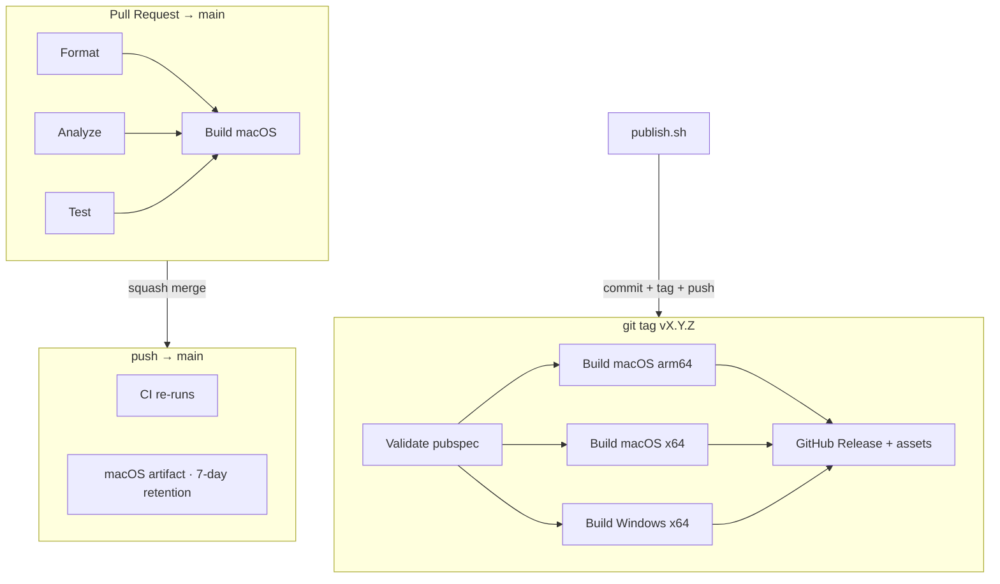

# CI/CD & Release Automation

Foundation for continuous integration and desktop release automation for AI Tray (PD-016).

**Scope today:** Protected `main` — PRs run Format / Analyze / Test / Build macOS; tagged releases build macOS + Windows and publish GitHub Releases.  
**Out of scope:** Code signing, notarization, Sparkle auto-update (documented as future work).

Aligned with house conventions from **CELPIP** (`ci.yml` job naming, Flutter pin, concurrency) and **MBO Research** (CHANGELOG-as-release-notes, SemVer on pubspec, tag `vX.Y.Z`).

---

## Pipeline overview



| Workflow | File | Trigger | Purpose |
|----------|------|---------|---------|
| **CI** | [`.github/workflows/ci.yml`](../../.github/workflows/ci.yml) | PR + push → `main` | Quality gates + macOS build verification |
| **Release** | [`.github/workflows/release.yml`](../../.github/workflows/release.yml) | Tag `v*.*.*` or manual dispatch | Desktop builds + GitHub Release |

**Flutter:** `3.38.9` (stable) · **App directory:** `ai_tray/`

---

## Comparison with existing repositories

| Aspect | CELPIP | MBO Research | AI Tray (this repo) |
|--------|--------|--------------|---------------------|
| Workflow name | `CI` | `ci` | `CI` |
| Job names (branch protection) | Format, Analyze, Test, Build Web | Analyze, Format, Test, Corpus | Format, Analyze, Test, Build macOS |
| Flutter pin | `3.38.9` env | `3.38.9` inline | `3.38.9` env |
| `subosito/flutter-action@v2` + cache | Yes | Yes | Yes |
| Concurrency cancel-in-progress | Yes | No | Yes |
| Deploy on merge | Firebase Hosting | N/A (CLI package) | GitHub Release on **tag only** |
| Release automation | Placeholder (web only) | Manual tag + CHANGELOG | **Automated** tag → builds → release |
| Version source | App pubspec | Package pubspec | `ai_tray/pubspec.yaml` |
| CHANGELOG | Yes | Yes (Keep a Changelog) | Yes |
| FVM / Melos / Fastlane | Melos stub; no FVM in CI | None | None (Flutter pin in workflow env) |
| One-command publish | Not yet | Not yet | `scripts/release/publish.sh` |

**Reuse decisions:** CELPIP’s parallel Format/Analyze/Test + gated build job, stable job `name:` fields, and Flutter cache strategy. MBO’s CHANGELOG + SemVer + `vX.Y.Z` tagging. AI Tray adds desktop release matrix and `publish.sh` (foundation for PD-017 one-command releases across all personal projects).

---

## Pull request CI

**Required checks (configure in branch protection):**

| Check name | Command |
|------------|---------|
| `Format` | `dart format --set-exit-if-changed .` |
| `Analyze` | `flutter analyze --fatal-infos` |
| `Test` | `flutter test` |
| `Build macOS` | `flutter build macos --release` |

Run locally before opening a PR:

```bash
cd ai_tray
flutter pub get
dart format --set-exit-if-changed .
flutter analyze --fatal-infos
flutter test
flutter build macos --release
```

---

## Main branch

On every push to `main`, CI re-runs all checks. The **Build macOS** job also uploads a short-lived artifact (`macos-arm64-build`, 7 days) for smoke verification — not a user-facing release asset.

---

## Release flow

### Automated path — “Publish AI Tray”

1. Add notes under `## [Unreleased]` in [`CHANGELOG.md`](../../CHANGELOG.md).
2. Ensure CI is green on `main`.
3. Run from repo root:

```bash
./scripts/release/publish.sh patch    # 1.0.0 → 1.0.1
./scripts/release/publish.sh minor    # 1.0.0 → 1.1.0
./scripts/release/publish.sh major    # 1.0.0 → 2.0.0
./scripts/release/publish.sh 1.0.0    # pin exact version (e.g. GA from RC)
./scripts/release/publish.sh patch --pre rc.1   # pre-release
./scripts/release/publish.sh patch --dry-run    # preview only
```

4. Script actions:
   - Bumps `ai_tray/pubspec.yaml` (single source of truth)
   - Moves `[Unreleased]` → `[X.Y.Z] — date` in CHANGELOG
   - Commits, creates annotated tag `vX.Y.Z`, pushes commit + tag
5. **Release** workflow triggers automatically:
   - Validates tag ↔ pubspec
   - Builds and packages:
     - `AI-Tray-macOS-arm64.zip`
     - `AI-Tray-macOS-x64.zip`
     - `AI-Tray-Windows-x64.zip`
   - Creates GitHub Release with CHANGELOG body

### Versioning rules

| Rule | Detail |
|------|--------|
| SemVer | `MAJOR.MINOR.PATCH` (+ optional `-prerelease`) |
| Single source | `ai_tray/pubspec.yaml` `version:` line only |
| Tag format | `v1.0.0` or `v1.0.0-rc.1` (must match pubspec name) |
| Build number | `+N` suffix auto-incremented by `publish.sh` |

**Note:** Legacy RC tags `v1.0.0-rc1` / `v1.0.0-rc2` predate automation; new pre-releases use `v1.0.0-rc.1` style to match pubspec.

---

## Release assets

| Asset | Runner | Build command |
|-------|--------|---------------|
| `AI-Tray-macOS-arm64.zip` | `macos-latest` | `flutter build macos --release` |
| `AI-Tray-macOS-x64.zip` | `macos-latest` | `arch -x86_64 flutter build macos --release` |
| `AI-Tray-Windows-x64.zip` | `windows-latest` | `flutter build windows --release` |

macOS zips contain `AI Tray.app`. Windows zip contains the `Release/` folder contents.

**Not attached (future):** dSYM / PDB symbols, signed/notarized builds, DMG/MSIX installers.

---

## Manual fallback

### Re-run release for an existing tag

GitHub → Actions → **Release** → **Run workflow** → enter tag (e.g. `v1.0.0`).

### Manual tag (emergency)

```bash
# 1. Bump pubspec + CHANGELOG manually
# 2. Commit
git tag -a v1.0.0 -m "AI Tray 1.0.0"
git push origin main
git push origin v1.0.0
```

### Local packaging only

See [RH-003-packaging.md](RH-003-packaging.md).

---

## Troubleshooting

| Symptom | Likely cause | Fix |
|---------|--------------|-----|
| Release fails: pubspec mismatch | Tag pushed without `publish.sh` | Align pubspec `version:` name with tag, re-tag |
| macOS x64 build fails | Rosetta / Xcode on runner | Check Actions log; build arm64 locally as fallback |
| Windows build fails | Desktop not enabled / VS missing | Runner has VS 2022; run `flutter doctor` in workflow |
| Format check fails on CI only | pub get skipped before format | CI runs `flutter pub get` first (CELPIP lesson) |
| Branch protection blocks merge | Stale check names | Require `Format`, `Analyze`, `Test`, `Build macOS` exactly |
| `[Unreleased]` empty | No changelog entry | Add notes before `publish.sh` |
| Duplicate release | Tag pushed twice | Delete release + tag in GitHub, fix, re-publish |

### Verify check names

```bash
gh api repos/roshandroids/AI_Tray/commits/<sha>/check-runs \
  --jq '.check_runs[] | select(.app.slug=="github-actions") | .name' | sort -u
```

---

## Branch protection checklist (Product Owner)

1. Settings → Rules → protect `main`
2. Require PR before merge
3. Require status checks: **Format**, **Analyze**, **Test**, **Build macOS**
4. Do **not** require Release workflow for merge (tag-only)

---

## Example release execution (dry run)

```bash
# From clean main with [Unreleased] populated:
./scripts/release/publish.sh 1.0.0 --dry-run

# Expected output:
# → New version: 1.0.0+3 (tag v1.0.0)
# → Updated CHANGELOG.md → [1.0.0]
# → Dry run — reverting pubspec and CHANGELOG edits
# → Would commit, tag v1.0.0, and push to origin
```

**Stop — awaiting Product Owner approval before the first automated release.**

---

## Related documents

- [CHANGELOG.md](../../CHANGELOG.md)
- [RH-003-packaging.md](RH-003-packaging.md)
- [release-notes-v1.0.0-rc2.md](release-notes-v1.0.0-rc2.md)
- CELPIP: `docs/workflows/CI_CD.md`
- MBO: `docs/RELEASE_GUIDE.md`

---

## PD-017 preview — one-command releases (all personal projects)

Target interface (not yet unified across repos):

```bash
publish patch    # → 1.0.1
publish minor    # → 1.1.0
publish major    # → 2.0.0
```

AI Tray implements this today via `./scripts/release/publish.sh`. CELPIP and MBO can adopt the same script layout when their desktop/store pipelines land.
