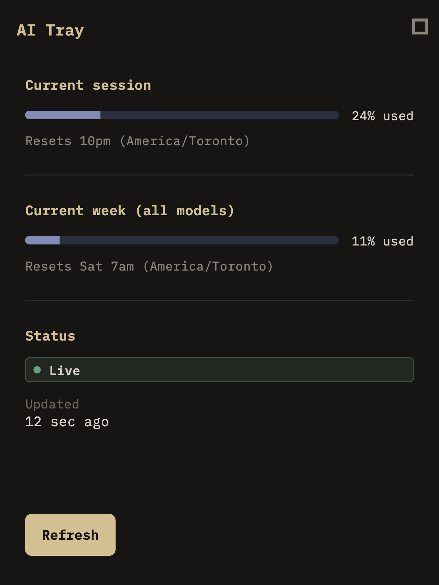

# PD-013 — Claude-Inspired Visual Refresh

**Status:** Ready for Product Owner review  
**Scope:** Visual layer only (RC2 feature freeze)  
**Date:** 2026-07-12

---

## 1. Before / After

### Before (RC2 Material MVP)

Plain Material 3 shell: light seed-blue theme, centered plain text for session/week %, no meters, no status badges.


### After (PD-013)

Charcoal desktop companion: beige section titles, lavender meters, status badges, relative “Updated” time, guided empty states. Bundled IBM Plex Mono.



> After image is the Flutter golden (`ai_tray/test/golden/goldens/pd013_after.png`) at 420×560. Rebuild Release and open the app for a live review.

---

## 2. Design rationale

**Inspiration:** Claude Code `/usage` atmosphere — charcoal ground, warm titles, soft secondary type, flat lavender meters — plus desktop tools like Warp, Ghostty, Raycast, and Linear.

**Improvements over a pixel clone**

- Companion layout (section meters + status footer), not a paste of CLI cost/model blocks we do not parse.
- Explicit **Live / Cached / Error / Refreshing** badges with label + color (not emoji-only).
- Relative **Updated** timestamp from existing `lastSuccessAt` / `fetchedAt`.
- Guided empty states per `FailureCode` instead of raw error strings.
- Subtle meter fill + content fade; no glass, gradients, or flashy motion.

**Design system (small)**

| Token file | Role |
|------------|------|
| `lib/core/theme/tray_tokens.dart` | Color, space, radius, layout |
| `lib/core/theme/tray_type.dart` | Monospace type scale |
| `lib/core/theme/tray_theme.dart` | Material 3 `ThemeData` |

---

## 3. Accessibility summary

| Check | Result |
|-------|--------|
| Contrast | Beige/lavender/primary on charcoal; status uses distinct hues **plus** text labels |
| Color-blind | Status never color-only (`Live`, `Cached`, `Error`, …) |
| Screen reader | `Semantics` on meters (label + %), badges, empty states |
| Keyboard | Settings icon, Refresh, and form controls remain focusable Material controls |
| Resize | Content max-width 420; scrollable body; window still ~420×560 |

---

## 4. Confirmation (visual layer only)

Explicitly confirmed:

- **No** parser changes  
- **No** business / refresh logic changes  
- **No** CLI parsing / adapter changes  
- **No** domain model / repository / cache architecture changes  
- **No** new data fields (cost, tokens, models, contribution)

Settings behavior unchanged (theme + type only).

---

## Definition of Done

| Item | Status |
|------|--------|
| Builds successfully | Yes (`flutter build macos --release`) |
| `flutter analyze` clean | Yes (verify on review) |
| Existing tests pass | Yes + new UI widget / golden tests |
| No behavior changes | Yes — presentation mapping only |
| Feels like a Claude Code companion | Ready for PO visual review |

---

## How to review live

```bash
cd ai_tray
flutter build macos --release
xattr -cr "build/macos/Build/Products/Release/AI Tray.app"
open "build/macos/Build/Products/Release/AI Tray.app"
```

**Stop here — awaiting Product Owner review before any further work.**
