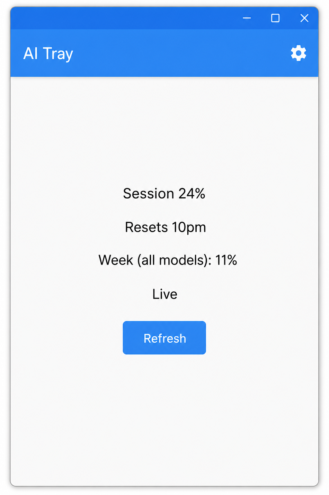
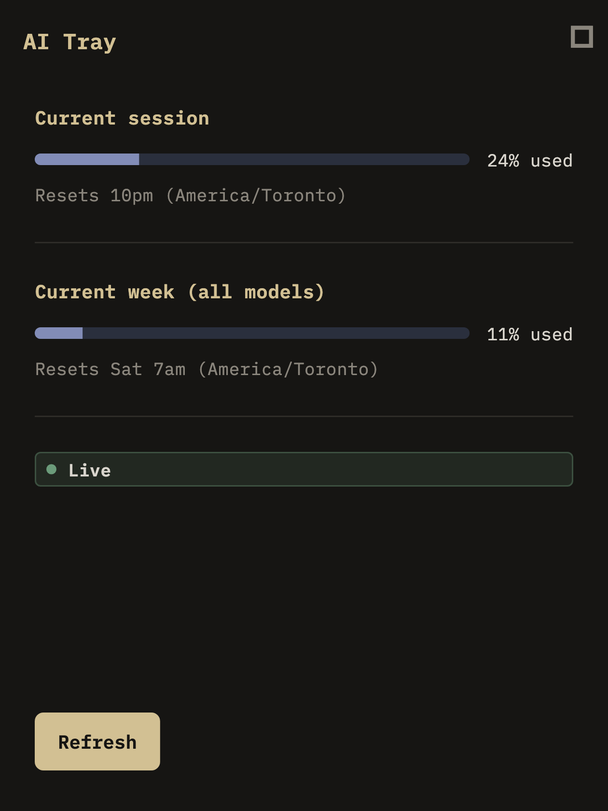
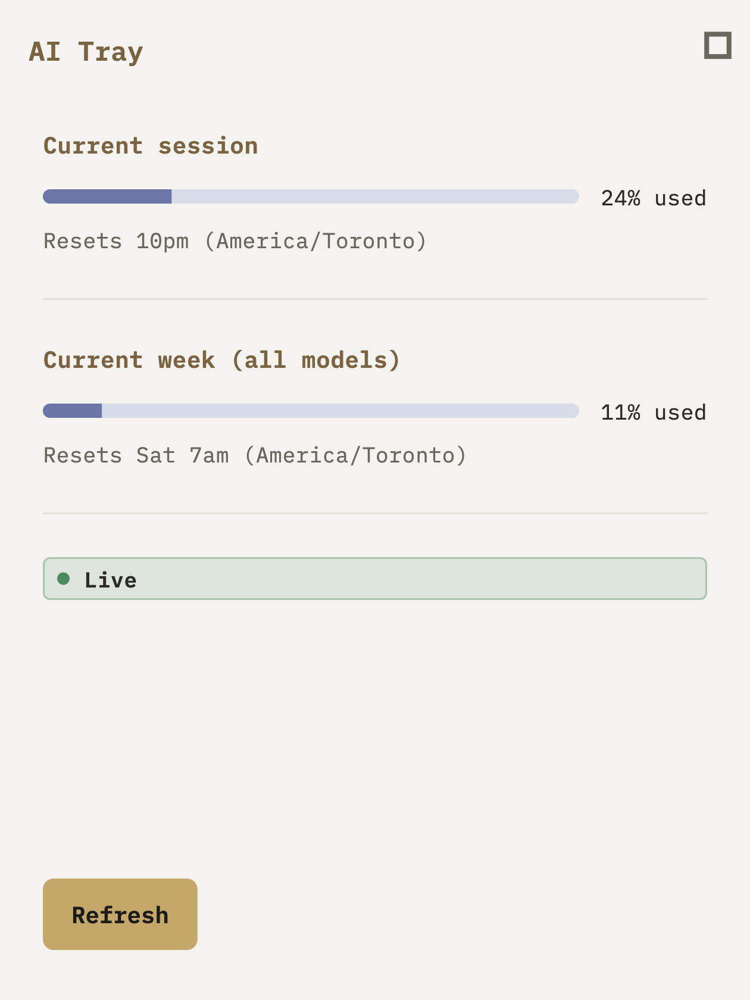

# PD-014 — Dynamic Theming

**Status:** Ready for Product Owner review  
**Scope:** UI infrastructure only (RC2 feature freeze)  
**Date:** 2026-07-12

---

## 1. Theme architecture overview

```
lib/core/theme/
├── app_theme_mode.dart    # AppThemePreference: system | light | dark
├── color_tokens.dart      # TrayColorTokens (ThemeExtension, dark + light)
├── typography.dart        # TrayTypography (ThemeExtension, from colors)
├── spacing.dart           # Spacing + layout constants
├── app_theme.dart         # AppTheme.light() / AppTheme.dark() → ThemeData
├── theme_context.dart     # context.colors / context.typography
└── theme_controller.dart  # Riverpod AsyncNotifier + persistence
```

**Data flow**

1. User picks **System / Dark / Light** in Settings → `ThemeController.setPreference`.
2. Preference persists in SharedPreferences via `AppSettings.themeMode`.
3. `AiTrayApp` watches `themeControllerProvider` and sets `MaterialApp.themeMode`.
4. Widgets read tokens through `context.colors` and `context.typography` — no hardcoded palette in UI widgets.

**System mode:** `AppThemePreference.system` maps to `ThemeMode.system`, which follows macOS appearance automatically.

---

## 2. Before / after screenshots

### Before (PD-013 — dark only)

Single hard-coded dark theme (`TrayTheme.dark()`). No user preference.



### After — Dark

Same PD-013 layout; colors from `TrayColorTokens.dark`.



### After — Light

Warm off-white companion theme; shared lavender meters and semantic status colors.



---

## 3. Tokenization confirmation

All UI widgets migrated off static `TrayTokens` / `TrayType`:

| Widget / screen | Token source |
|-----------------|--------------|
| `UsagePage`, meters, badges, empty states | `context.colors`, `context.typography`, `Spacing` |
| `SettingsPage` | Theme + `SegmentedButton` for mode |
| `AppTheme` | `TrayColorTokens` + `TrayTypography` extensions |
| Removed | `tray_tokens.dart`, `tray_type.dart`, `tray_theme.dart` |

No `Color(0x…)` literals remain in presentation widgets.

---

## 4. Accessibility contrast verification

Approximate WCAG contrast ratios (normal text, 4.5:1 target):

| Pair | Dark | Light |
|------|------|-------|
| Primary text on background | `#D8D4CC` on `#161513` ≈ **11.5:1** | `#2C2A26` on `#F5F3EF` ≈ **11.8:1** |
| Section title on background | `#D2C093` on `#161513` ≈ **8.9:1** | `#7A6340` on `#F5F3EF` ≈ **5.2:1** |
| Secondary text on background | `#8A857C` on `#161513` ≈ **5.4:1** | `#6B665E` on `#F5F3EF` ≈ **5.1:1** |
| Success badge dot + label | Green + text label (never color-only) | Same |
| Error text | `#C4756B` on `#161513` ≈ **4.8:1** | `#B85C52` on `#F5F3EF` ≈ **4.6:1** |

Status badges always include a text label (`Live`, `Cached`, `Error`, …) alongside the dot.

---

## 5. Confirmation (UI infrastructure only)

- **No** parser, adapter, repository, cache, or refresh logic changes
- **No** layout redesign beyond Settings theme control
- **No** new usage data fields

---

## 6. Suggested Conventional Commit

```
feat(theme): add light/dark/system dynamic theming (PD-014)

- Introduce tokenized theme system with ThemeExtension colors and typography
- Persist theme preference in AppSettings; apply live via ThemeController
- Add System/Dark/Light control in Settings
```

---

## Definition of Done

| Item | Status |
|------|--------|
| Light / Dark / System modes | Yes |
| Persisted preference | Yes |
| Immediate apply (no restart) | Yes |
| Tokenized colors | Yes |
| `flutter analyze` clean | Yes (info-only) |
| Tests pass | Yes (67) |
| Release build | Verify locally |

**Stop here — awaiting Product Owner review.**
