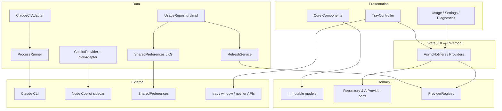
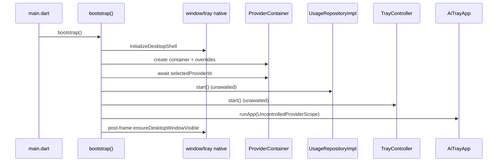
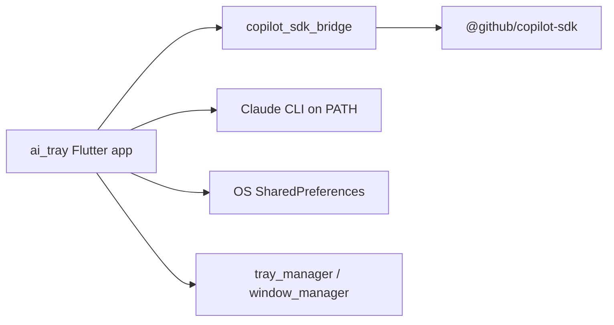
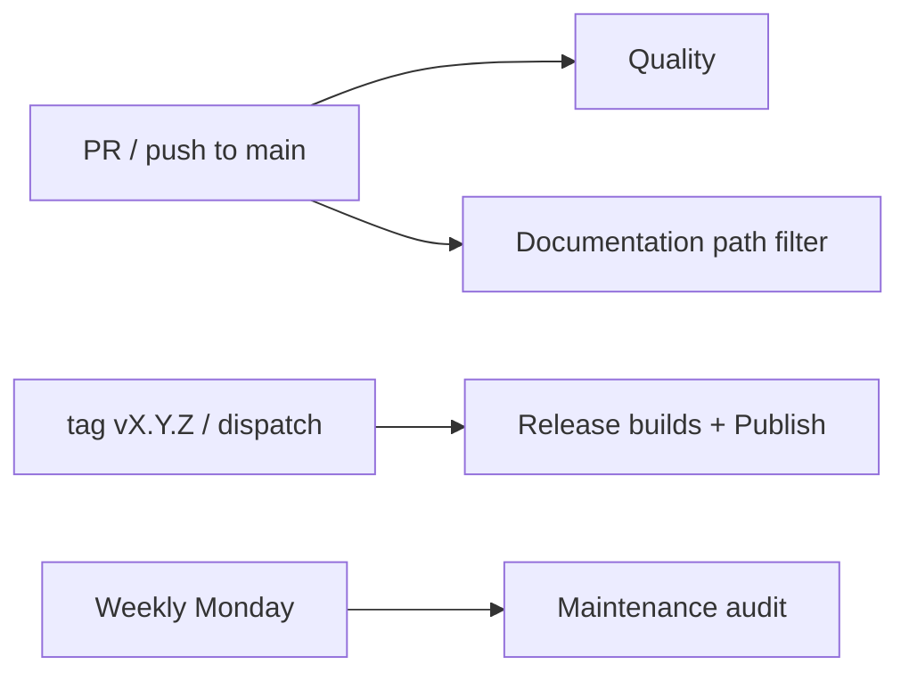
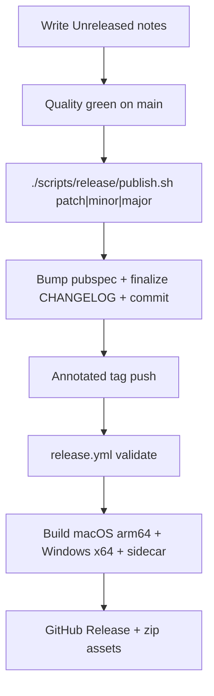

# AI Tray — Project Intelligence Report

**Generated:** 2026-07-28  
**Repository:** `roshandroids/AI_Tray` (`AI_Tray_Project`)  
**Analyzed revision:** branch `cursor/ep004a-local-first-ci` @ `99a9f7f` (plus local uncommitted demo-strategy / handoff sync)  
**Current product version:** `1.3.3+9` (tag `v1.3.3`)  
**Purpose of this document:** Exhaustive technical knowledge capture so another engineering team could recreate this project's architecture, practices, and tooling without reading the source tree. Intended for cross-project pattern mining and template synthesis.

> **Relationship to other docs:** Day-to-day AI/session SSOT remains `docs/project/` (handoff package). This report is a broader engineering blueprint. Prefer handoff for *current work*; prefer this report for *how the system is built*.

---

## Table of contents

1. [Executive Summary](#1-executive-summary)
2. [Repository Structure](#2-repository-structure)
3. [Folder Organization](#3-folder-organization)
4. [Architecture](#4-architecture)
5. [State Management](#5-state-management)
6. [Dependency Injection](#6-dependency-injection)
7. [Packages](#7-packages)
8. [Local Packages](#8-local-packages)
9. [Navigation](#9-navigation)
10. [Data Layer](#10-data-layer)
11. [UI System](#11-ui-system)
12. [Design Tokens](#12-design-tokens)
13. [Localization](#13-localization)
14. [Assets](#14-assets)
15. [Configuration](#15-configuration)
16. [Build System](#16-build-system)
17. [Testing](#17-testing)
18. [Code Quality](#18-code-quality)
19. [Documentation](#19-documentation)
20. [ADRs](#20-adrs)
21. [GitHub](#21-github)
22. [CI/CD](#22-cicd)
23. [Automation Scripts](#23-automation-scripts)
24. [Developer Experience](#24-developer-experience)
25. [AI Integration](#25-ai-integration)
26. [Security](#26-security)
27. [Performance](#27-performance)
28. [Release Process](#28-release-process)
29. [Code Metrics](#29-code-metrics)
30. [Engineering Practices](#30-engineering-practices)
31. [Reusable Ideas](#31-reusable-ideas)
32. [Project Blueprint](#32-project-blueprint)
33. [Lessons Learned](#33-lessons-learned)

---

## 1. Executive Summary

### What is this project?

**AI Tray** is a **Flutter desktop companion application** that surfaces AI-provider **subscription usage and health** in a shared **macOS menu-bar** / **Windows system-tray** experience. Users see live or last-known-good quota meters without opening each vendor's CLI/TUI.

### Primary purpose

- Aggregate **Claude Code** and **GitHub Copilot** usage into one always-available desktop surface.
- Prefer **official, documented data sources** only (Claude CLI `/usage`; Copilot SDK `account.getQuota`).
- Never invent usage percentages; degrade gracefully with labeled stale/cached data.

### Target users

- Developers who already use Claude Code and/or GitHub Copilot on macOS (primary) or Windows (experimental).
- Personal / power-user desktop tooling audience (unsigned zips via GitHub Releases; no App Store / MSIX store pipeline yet).

### Current maturity

| Dimension | State |
| --- | --- |
| Product release | **v1.3.3** shipped; EP-002 Phase 3 Copilot UI is on `main` but **not yet tagged** as a newer release |
| Claude provider | **Stable** |
| Copilot provider | **Experimental** (official SDK sidecar) |
| Cursor provider | **Research only** (PD-023 — no production quota code) |
| macOS arm64 | **Supported** |
| Windows x64 | **Experimental** (PD-010 — hardware dogfood pending) |
| Flutter Web | **Not supported** (PD-025 — product-as-demo via desktop Releases) |
| Architecture posture | Feature-first Clean Architecture; **EP-004 = targeted cleanup**, not rewrite (ADR-004 / PD-024) |
| CI posture | **Local First** (EP-004A): quality on PR; desktop builds on tag/dispatch only |

### Architecture style

- **Feature-first Clean Architecture:** UI → State → Domain → Data.
- **Capability-driven multi-provider platform** via `ProviderRegistry` (PD-021 / ADR-003).
- **Riverpod 3** Notifier / AsyncNotifier / AsyncValue (no codegen).
- **External process adapters:** Claude via local CLI; Copilot via bundled **Node NDJSON sidecar**.

### Technology stack

| Layer | Choice |
| --- | --- |
| UI / runtime | Flutter stable **3.38.9** (CI pin), Dart SDK `^3.10.8` |
| State / DI | `flutter_riverpod` ^3.3.2 |
| Desktop shell | `tray_manager`, `window_manager`, `local_notifier`, `launch_at_startup` |
| Persistence | `shared_preferences` |
| Lint | `very_good_analysis` ^10.1.0 |
| Copilot bridge | TypeScript Node package `@github/copilot-sdk@1.0.7`, Node **22.17.0**, npm **10.9.2** |
| CI | GitHub Actions (Quality / Documentation / Release / Maintenance) |
| Hooks | Optional Lefthook |

### Overall complexity

**Medium–high for a single-app desktop product**, driven by:

1. Dual-runtime packaging (Flutter + pinned Node sidecar).
2. Provider-platform abstraction with resilience (single-flight, backoff, LKG, stale rejection).
3. Heavy documentation / governance surface (~97 docs files + handoff package).
4. Relatively **lean** Flutter dependency graph (8 direct prod deps; no HTTP client, no router, no codegen).

Approximate size: **~129 lib Dart files / ~11.7k LOC**, **~36 test Dart files / ~7.3k LOC**, plus a TypeScript sidecar and extensive docs.

---

## 2. Repository Structure

This is a **polyglot product monorepo in spirit**, but **not** a Melos/pub-workspace monorepo. There is one Flutter app package (`ai_tray/`) plus docs, scripts, research, showcase, and CI at the repository root.

### Top-level tree

```text
AI_Tray_Project/
├── .cursor/                    # Cursor AI rules (always-on handoff)
├── .github/workflows/          # CI/CD workflows only
├── ai_tray/                    # Flutter desktop application (the product)
├── docs/                       # Engineering, product, release, dogfood docs
├── research/                   # Early Claude CLI PoC (Python harness)
├── scripts/                    # CI validation + release automation
├── showcase/                   # RSProjects demo catalog contract
├── lefthook.yml                # Optional local git hooks
├── README.md                   # Product landing
├── CHANGELOG.md                # Keep a Changelog + SemVer
├── AI_Tray_Product_Owner_Master_Roadmap.md   # Historical PO SoT
├── AI_Tray_Autonomous_Execution_Guide.md     # Historical MVP AI guide
└── AI_Tray_Phase2_Stabilization_Checklist.md # Historical Phase 2 checklist
```

### Why each top-level folder exists

| Path | Why it exists |
| --- | --- |
| `ai_tray/` | Isolates the Flutter package so root can hold governance, research, and CI without polluting `pubspec.yaml`. Enables `WORKING_DIRECTORY: ai_tray` in Actions. |
| `docs/` | Living engineering knowledge base; separates durable docs from code. Subfolders encode *audience* (guides vs adr vs release vs project handoff). |
| `docs/project/` | Official **AI session handoff package** (D-011) — machine + human resume state. |
| `scripts/` | Shell automation for release SemVer and CI gates; keeps YAML workflows thin. |
| `research/` | Preserves Task-0001 Claude CLI PoC evidence (fixtures, timing) without becoming production code. |
| `showcase/` | Machine-readable catalog for an external RSProjects portal (`metadata.json` + `demos.json`). |
| `.github/` | GitHub Actions only — deliberately minimal (no Dependabot/templates yet). |
| `.cursor/` | Enforces handoff maintenance for Cursor agents. |
| Root `AI_Tray_*.md` | Historical Product Owner / autonomous-delivery artifacts; **superseded for day-to-day** by `docs/project/`. |

### Intentionally absent top-level folders

| Common pattern | Status here | Why |
| --- | --- | --- |
| `apps/` / `packages/` | Absent | Single app; no shared Dart packages extracted yet |
| `melos.yaml` / pub workspaces | Absent | Unnecessary complexity at current scale |
| `android/` / `ios/` / `web/` / `linux/` | Absent | Desktop-only product (macOS + Windows) |
| `.fvm/` | Absent | Flutter version pinned in CI env vars, not FVM |
| `.claude/` | Absent | Claude Code project skills not committed |
| `integration_test/` | Absent | Desktop tray/window flows covered by dogfood checklists + unit/widget/golden |

---

## 3. Folder Organization

### Philosophy

1. **Feature-first:** Product capabilities live under `lib/features/<feature>/`.
2. **Clean Architecture layering inside features:** `presentation/` → `domain/` → `data/` (UI never imports adapters directly for business flows).
3. **Shared core for cross-cutting concerns:** theme, errors, Result, logging, DI wiring, reusable components.
4. **Provider platform split:** Canonical provider contracts under `features/providers/core/`; Copilot implementation under `features/providers/copilot/`; Claude under `features/providers/data/claude/`.
5. **Compatibility shims over big-bang moves:** Many `domain/` and `data/copilot/` files are **1–2 line re-exports** pointing at canonical paths (EP-004 debt to remove carefully).

### `ai_tray/lib/` structure

```text
lib/
├── main.dart                 # entry → bootstrap()
├── bootstrap.dart            # bindings, DI container, tray + usage start
├── app.dart                  # MaterialApp + theme + home
├── core/
│   ├── components/           # design-system widgets (meters, badges, chrome)
│   ├── constants/            # placeholder (.gitkeep)
│   ├── di/providers.dart     # central Riverpod wiring + re-exports
│   ├── errors/               # AppFailure, FailureCode
│   ├── logging/              # AppLogger hierarchy + providers
│   ├── result/result.dart    # Result<T> sealed success/failure
│   ├── theme/                # tokens + ThemeData + theme controller
│   ├── utils/                # placeholder (.gitkeep)
│   └── widgets/              # terminal_chrome
├── features/
│   ├── diagnostics/presentation/
│   ├── notifications/{data,domain,presentation}/   # scaffold only
│   ├── providers/
│   │   ├── core/             # ports, models, registry, process barrel, cache
│   │   ├── copilot/          # canonical Copilot SDK + sidecar + adapter
│   │   ├── data/             # Claude adapter, process runners, re-export shims
│   │   ├── domain/           # mostly re-exports → core
│   │   ├── presentation/     # provider selector UI + notifier
│   │   └── provider_providers.dart
│   ├── settings/{data,domain,presentation}/
│   ├── tray/presentation/
│   └── usage/{data,domain,presentation}/
└── shared/widgets/           # reserved; currently empty (.gitkeep)
```

### Feature inventory

| Feature | Responsibility | Maturity |
| --- | --- | --- |
| `usage` | Refresh loop, LKG cache, dashboard home UI, domain usage models | Core / mature |
| `providers` | Multi-provider registry, Claude CLI, Copilot sidecar, selection | Core / mature with alias debt |
| `tray` | Tray icon/menu, window lifecycle hooks, OS notifications, launch-at-login | Core / mature |
| `settings` | App settings persistence + settings page | Mature |
| `diagnostics` | Diagnostics + logs pages; Copilot diagnostics controller | Mature |
| `notifications` | Folder scaffold only — real notify path lives in tray | Stub |

### Naming conventions

| Kind | Convention | Example |
| --- | --- | --- |
| Files | `snake_case.dart` | `usage_repository_impl.dart` |
| Types | `PascalCase` | `UsageRepositoryImpl` |
| Providers | `camelCase` + `Provider` / `Notifier` suffix | `usageRepositoryProvider` |
| Ports | Abstract classes / typedefs in `ports/` | `AIProvider`, `ProcessRunner` |
| DTOs | Suffixed `Dto`, provider-scoped | `CopilotQuotaResponseDto` |
| Tests | `*_test.dart` under `test/{unit,widget,golden,screenshot}/` | `refresh_service_test.dart` |
| Goldens | Ticket/epic prefixes | `pd013_`, `ep002_` |
| ADRs | `ADR-NNN-kebab-topic.md` | `ADR-001-claude-cli-data-source.md` |
| Product decisions | `PD-NNN` | `PD-021` |
| Commits | Conventional Commits | `feat:`, `fix:`, `ci:` |

### Barrel exports & shims

- **True barrels:** `core/di/providers.dart`, `core/theme/spacing.dart` (re-exports radius/shadows), `providers/core/process/process.dart`.
- **Alias shims (~35 files):** `features/providers/domain/**` and `features/providers/data/copilot/**` re-export canonical `core/` / `copilot/` types so old imports keep compiling during targeted cleanup (ADR-004).

### Shared code strategy

- **Design system widgets** → `lib/core/components/` (not feature-local).
- **Theme tokens** → `lib/core/theme/`.
- **Errors / Result / logging** → `lib/core/`.
- **Feature UI** stays in feature `presentation/` unless reused twice with a clear shared role.
- `lib/shared/` reserved but unused — prefer `core/components` today.

---

## 4. Architecture

### Pattern summary

| Pattern | Applied? | Notes |
| --- | --- | --- |
| Clean Architecture | Yes | UI → State → Domain → Data; DTOs not shown in UI |
| Feature-first | Yes | Features own vertical slices |
| Layered architecture | Yes | Within and across features |
| Package architecture | Partial | One Flutter package + one Node tool package |
| Hexagonal / ports & adapters | Yes | `AIProvider`, `ProcessRunner`, repositories |
| Capability-driven UI | Yes | Render `DashboardData` + capabilities, not provider IDs |
| CQRS / event sourcing | No | Simple refresh + streams |

### Dependency direction



### Invariants (must preserve when recreating)

1. UI never calls CLIs/SDKs directly.
2. DTOs map to app-owned domain models before UI.
3. `ProviderRegistry` + capability-driven shared UI.
4. Provider-scoped single-flight refresh, bounded retry, LKG cache, generation-based stale rejection, dispose-safe completion.
5. Never invent usage values; label stale data.
6. No `/copilot_internal`, undocumented APIs, or scraping.

### Bootstrap sequence



### Provider platform

- **Claude (default):** `ClaudeCliAdapter` runs `claude -p '/usage' --output-format json` (never `--bare`), parses free-text Shape A / Shape B.
- **Copilot (experimental):** Flutter talks NDJSON protocol v1 to a bundled Node bridge that alone imports `@github/copilot-sdk` and calls `account.getQuota`.
- **Cursor:** Research docs only; blocked from production by PD-023.

### Architecture debt (known)

- ~35 compatibility alias files between `domain/` / `data/copilot/` and canonical namespaces.
- `features/notifications/` empty while tray owns notifications.
- Some contributor docs still describe Claude-only or RC2 freeze era.

---

## 5. State Management

### Choice: Riverpod 3 only

| Approach | Used? |
| --- | --- |
| Riverpod `Provider` / `Notifier` / `AsyncNotifier` / `AsyncValue` | **Yes** |
| `StateNotifier` / legacy Provider | No |
| Bloc / Cubit | No |
| GetX / MobX | No |
| Riverpod codegen (`@riverpod`) | **No** — manual providers |
| ValueNotifier as app architecture | No (local UI only if incidental) |

### Why Riverpod

- Matches team Flutter standards (Notifier / AsyncNotifier / AsyncValue).
- Natural DI graph with overrides for tests.
- Fits async usage refresh + settings persistence without codegen ceremony.

### Major providers / notifiers

| Provider | Kind | Role |
| --- | --- | --- |
| `themeControllerProvider` | `AsyncNotifier` | System / dark / light preference |
| `settingsControllerProvider` | `AsyncNotifier` | Settings CRUD |
| `selectedProviderIdProvider` | `AsyncNotifier` | Claude vs Copilot selection |
| `copilotDiagnosticsProvider` | `AsyncNotifier` | Copilot health/version for diagnostics UI |
| `settingsOpenRequestProvider` | `Notifier<int>` | Tray → open Settings signal |
| `usageRepositoryProvider` | `Provider` | Owns refresh lifecycle; `ref.onDispose` |
| `providerRegistryProvider` | `Provider` | Registers Claude + Copilot |
| `trayControllerProvider` | `Provider` | Tray/window/notifications orchestration |
| Logging / prefs / process / sidecar factories | `Provider` | Infrastructure |

### Lifecycle notes

- App uses **`ProviderContainer` + `UncontrolledProviderScope`** so bootstrap can start repositories/tray before `runApp`.
- Usage refresh starts via `UsageRepositoryImpl.start()` after DI is ready.
- Tray listens to `UsageRepository.watchStatus()` to rebuild menu/icon.
- Dispose-safe refresh completion and generation tokens prevent stale updates after provider switch (post-EP-002 stabilization).

### Controllers vs repositories vs services

| Role | Location | Responsibility |
| --- | --- | --- |
| Controllers / Notifiers | `presentation/` or `core/theme` | UI-facing async state |
| Repositories | `domain` port + `data` impl | Orchestrate persistence + refresh |
| Services | `data/services` | Refresh pipeline, diagnostics |
| Adapters | `data/` / `copilot/` | Talk to CLI/SDK |

---

## 6. Dependency Injection

### Strategy

- **Riverpod is the DI container** — no `get_it`, no `injectable`, no manual service locator.
- Dependencies are **constructor-injected** into repositories/services/adapters; Riverpod factories assemble them.
- **Lazy by default** (Riverpod creates on first `read`/`watch`).
- **Singletons** are effectively Provider-scoped instances living for the container lifetime (one app container).

### Registration site

Primary: `lib/core/di/providers.dart` and feature `*_providers.dart` files (`provider_providers.dart`, `settings_providers.dart`, `logging_providers.dart`).

### Bootstrap overrides

```text
ProviderContainer(
  overrides: [
    bufferedAppLoggerProvider.overrideWithValue(bufferedLogger),
    sharedPreferencesProvider.overrideWithValue(prefs),
  ],
)
```

`sharedPreferencesProvider` **must** be overridden (or tests use `SharedPreferences.setMockInitialValues`).

### Test DI

- `ProviderScope` / container overrides with fakes.
- `FakeProcessRunner` in production lib for a testable process boundary.
- Per-test fakes (`_FakeProvider`, `_FakeUsageRepository`, `_FakeCopilotSdk`) — **no mockito/mocktail**.

### Sidecar command selection

Compile-time `bool.fromEnvironment('dart.vm.product')` chooses:

- **Dev:** run bridge from `tool/copilot_sdk_bridge` via local Node.
- **Release:** run bundled Node + bridge under app Resources (macOS) or exe-adjacent `copilot_sdk/` (Windows).

---

## 7. Packages

### Production dependencies (Flutter `ai_tray`)

| Package | Constraint | Resolved (approx) | Why | Core? | Where used |
| --- | --- | --- | --- | --- | --- |
| `flutter` | SDK | — | UI framework | Core | Everywhere |
| `flutter_riverpod` | ^3.3.2 | 3.3.2 | State management + DI | Core | bootstrap, all features |
| `tray_manager` | ^0.5.3 | 0.5.3 | Menu bar / tray icon & menu | Core | `features/tray` |
| `window_manager` | ^0.5.2 | 0.5.2 | Desktop window show/hide/size/prevent-close | Core | tray / bootstrap shell |
| `launch_at_startup` | ^0.5.1 | 0.5.1 | Open at login | Core | tray settings; macOS custom MethodChannel |
| `local_notifier` | ^0.1.6 | 0.1.6 | OS notifications | Core | tray controller |
| `shared_preferences` | ^2.5.5 | 2.5.5 | Settings + LKG usage cache | Core | settings, usage cache |
| `meta` | ^1.17.0 | 1.17.0 | `@immutable` annotations | Core | domain models |

**Notable transitive:** `screen_retriever` (via `window_manager`) for display metrics.

**Explicitly not used:** `go_router`, `dio`/`http`, `freezed`, `json_serializable`, `build_runner`, localization packages, Firebase, analytics SDKs.

### Development dependencies (Flutter)

| Package | Why | Core? |
| --- | --- | --- |
| `flutter_test` | Unit / widget / golden tests | Core |
| `very_good_analysis` | Strict lint baseline | Core |

### Copilot bridge (`ai_tray/tool/copilot_sdk_bridge`) — production

| Package | Version | Why | Core? |
| --- | --- | --- | --- |
| `@github/copilot-sdk` | **1.0.7** (pinned) | Official quota API surface | Core for Copilot |

Runtime assembly also pins **Node 22.17.0**, **npm 10.9.2**, Copilot CLI package, and **koffi** native bindings per target (see `distribution/manifest.json`).

### Copilot bridge — development

| Package | Version | Why |
| --- | --- | --- |
| `typescript` | 5.8.3 | Compile bridge |
| `@types/node` | 24.0.15 | Node typings |

### Internal / local packages

See [§8](#8-local-packages). Not published to pub.dev (`publish_to: "none"`).

---

## 8. Local Packages

### Flutter app package: `ai_tray`

| Attribute | Value |
| --- | --- |
| Path | `ai_tray/` |
| Pub name | `ai_tray` |
| Version | `1.3.3+9` |
| Public API | Application — not a library |
| Responsibilities | Entire desktop product |

### Node tool package: `ai-tray-copilot-sdk-bridge`

| Attribute | Value |
| --- | --- |
| Path | `ai_tray/tool/copilot_sdk_bridge/` |
| npm name | `ai-tray-copilot-sdk-bridge` |
| Private | `true` |
| Public surface | NDJSON stdio protocol v1 (`bridge_cli.js`) |
| Responsibilities | Isolate `@github/copilot-sdk` import; expose quota/session/health/version RPCs; offline-assembled sidecar payload |

### Dependency graph



There are **no** Dart path packages under `packages/`. The bridge is a **tooling/runtime sidecar**, not a pub dependency.

---

## 9. Navigation

### Routing package

**None.** No `go_router`, `auto_route`, or named routes table.

### Structure

- Single `MaterialApp(home: UsagePage())` in `lib/app.dart`.
- Secondary screens via imperative `Navigator.push` / `pop`:
  - Settings
  - Diagnostics
  - Logs
- Tray menu actions focus/show the existing window or trigger refresh/settings/quit.

### Deep linking

**Not implemented.** Desktop tray apps are launched as OS apps; no custom URL scheme / universal links in scope.

### Route guards / shell routes

**Not applicable** (no router). Auth is **provider CLI/SDK auth**, not app login screens — failures surface as `FailureCode.notAuthenticated` and pause auto-refresh.

### Window as "shell"

The desktop window + tray combination acts as the application shell:

- `setPreventClose(true)` — closing window hides; app stays alive (macOS `applicationShouldTerminateAfterLastWindowClosed = false`).
- Tray Quit exits the process.

---

## 10. Data Layer

### Overview

```text
UI / Notifiers
  → UsageRepository (port)
    → RefreshService (single-flight + retry policy)
      → ProviderRegistry → AIProvider adapter
        → ProcessRunner (Claude) OR Sidecar transport (Copilot)
      → Parser / Validator / Mapper
    → UsageCache (SharedPreferences LKG)
  → SettingsRepository → SharedPreferences
```

### Repositories

| Repository | Impl | Persistence |
| --- | --- | --- |
| `UsageRepository` | `UsageRepositoryImpl` | In-memory status stream + LKG prefs |
| `SettingsRepository` | `SharedPreferencesSettingsRepository` | SharedPreferences |

### Services

| Service | Role |
| --- | --- |
| `RefreshService` | Fetch → parse → validate → cache; **intended single retry owner** (ADR-004) |
| `DashboardDataMapper` | Domain → capability-aware dashboard model |
| `CopilotDiagnosticsService` | Health/version via SDK + metadata cache |

### API layer

- **No HTTP client in Flutter.**
- Claude: spawn local process.
- Copilot: NDJSON lines over stdio to sidecar; allowlisted DTOs in `copilot_protocol_v1_dto.dart`.

### Local storage & caching

| Store | Keys / scope | Purpose |
| --- | --- | --- |
| SharedPreferences settings | App settings model | Theme, intervals, notifications, provider selection, etc. |
| LKG usage cache | `usage_lkg_v1` (legacy) + `usage_lkg_v2_<providerId>` | Last known good snapshot per provider |
| `ProviderMetadataCache` | In-memory | Copilot health/version metadata |

### Cache age policy (ADR-002)

- Soft max ~**6 hours** (warn / stale labeling).
- Hard max ~**24 hours** (blank rather than show ancient data).

### Serialization

- Hand-written `fromJson` / `jsonDecode` — **no** `json_serializable` / freezed.
- Claude: defensive text parsers for Shape A (usable) vs Shape B (degraded).
- Copilot: protocol v1 DTOs mapped through `CopilotQuotaMapper` / usage parser.

### Error model

- Sealed `Result<T>` preferred over throwing for expected failures.
- `AppFailure` + `FailureCode` enum: `cliNotInstalled`, `notAuthenticated`, `timeout`, `processLaunchFailed`, `processNonZeroExit`, `parserFailure`, `unknownCliOutput`, `incompleteOutput`, `cacheUnavailable`, `cancelled`, `unknown`.

### Process abstraction

| Type | Role |
| --- | --- |
| `ProcessRunner` | Port |
| `IoProcessRunner` | Real desktop process |
| `FakeProcessRunner` | Deterministic tests |
| `DesktopProcessEnvironment` | PATH enrichment for GUI-launched apps (Homebrew etc.) |

---

## 11. UI System

### Design direction (PD-021)

Terminal-inspired, developer-first, dense, **minimal chrome**. Peers: Claude Code, Warp, Ghostty, Raycast, Linear, GitHub Desktop.

### Themes

- Material 3 `ThemeData` built from semantic tokens (`app_theme.dart`).
- Dark (default GitHub-dark) + intentional light palette (not a naive invert).
- User preference: System / Dark / Light via `themeControllerProvider`.

### Reusable components (`lib/core/components/`)

| Component | Purpose |
| --- | --- |
| `progress_ring` | Circular usage meter |
| `usage_progress_bar` | Linear meter |
| `metric_card` | Metric display block |
| `status_badge` | Live / cached / error / refreshing |
| `log_chip` | Log level chip |
| `section_chrome` | InfoRow, SectionCard, TerminalPanel, SectionDivider |
| `settings_chrome` | SettingsNavRail, SettingsTile, SettingsGroup |

Access pattern: `context.colors`, `context.typography`, `Spacing.*`, `RadiusTokens.*`.

### Screens

| Screen | File | Role |
| --- | --- | --- |
| Usage (home) | `usage_page.dart` | Dashboard rings, provider health, refresh |
| Settings | `settings_page.dart` | Preferences + left rail |
| Diagnostics | `diagnostics_page.dart` | Provider/CLI diagnostics |
| Logs | `logs_page.dart` | Buffered structured logs |

### Responsive / adaptive

- Fixed desktop window (~720×640, min 420×480) — **not** a mobile responsive app.
- `contentMaxWidth = 720` keeps composition readable.
- Tray icon: macOS uses **painted dynamic ring**; Windows uses **static status PNGs**.

### Capability-driven UI rule

Widgets consume `DashboardData` + `ProviderCapabilities`. Avoid `if (providerId == copilot)` branching in presentation (ADR-003).

---

## 12. Design Tokens

Source of truth: `docs/design/DESIGN_SYSTEM.md` + `lib/core/theme/*`.

### Colors — dark (default)

| Token | Hex | Role |
| --- | --- | --- |
| background | `#0D1117` | Window canvas |
| surface | `#161B22` | Panels |
| surfaceAlt | `#21262D` | Elevated / hover |
| border | `#30363D` | Separators |
| textPrimary | `#E6EDF3` | Titles & values |
| textSecondary | `#8B949E` | Labels |
| textMuted | `#6E7681` | Captions |
| success | `#22C55E` | Live / 0–50% |
| warning | `#EAB308` | Cached / 50–80% |
| highUsage | `#F97316` | 80–95% |
| error | `#EF4444` | Failures / 95%+ |
| info | `#3B82F6` | Refreshing |
| purpleAccent | `#A855F7` | Primary accent / focus |
| cyanAccent | `#06B6D4` | Secondary accent |
| onAccent | `#0D1117` | Text on accent |
| buttonDisabled | `#30363D` | Disabled controls |
| meterTrack | `#21262D` | Meter background |

Light palette lives in `TrayColorTokens.light` (GitHub-light semantics).

### Usage bands

| Percent | Color token |
| --- | --- |
| 0–50 | success |
| 50–80 | warning |
| 80–95 | highUsage |
| 95+ | error |

API: `TrayColorTokens.usageBand(percent)`.

### Spacing (8-point scale)

| Token | px |
| --- | --- |
| xs | 4 |
| sm | 8 |
| md | 16 |
| lg | 24 |
| xl | 32 |
| xxl / twoXl | 48 |

Layout: `contentMaxWidth=720`, `settingsRailWidth=168`, `meterHeight=4`, `progressRingSize=72`, `trayIconSize=22`.

### Radius

| Token | Value |
| --- | --- |
| none | 0 |
| sm | 4 |
| md | 6 |
| lg | 8 |
| full | 999 |

### Elevations / shadows

**Prefer borders over shadows.** `ShadowTokens.none` is the default elevation strategy.

### Typography

| Preset | Size / weight | Use |
| --- | --- | --- |
| display / title | 18 / 700 | App title |
| section | 14 / 600 | Section headers |
| label | 12 / 500 | Field labels |
| body | 12 / 400 | Body |
| caption | 11 / 400 | Hints |
| monoData | 12 / 500 | Metrics |
| status | 12 / 600 | Badges |
| terminalOutput | 12 / 400 | Logs |
| button | (tokenized) | Buttons |
| error | (tokenized) | Errors |

Families: **JetBrains Mono** → IBM Plex Mono → Menlo / SF Mono / Monaco / Consolas / Cascadia / Courier New / monospace.

### Icon sizes

`IconTokens`: sm 14, md 16, lg 18, rail 16.

### Animations

No dedicated animation token system. Motion is minimal; tray icon state changes and progress rings provide status presence. No Lottie/Rive dependency.

---

## 13. Localization

**Not implemented.**

| Mechanism | Status |
| --- | --- |
| ARB files | Absent |
| `l10n.yaml` | Absent |
| `flutter_localizations` | Absent |
| Supported locales | English hardcoded UI strings only |

**Implication for recreation:** All tray menu labels and screens are English string literals. Adding l10n later would be a cross-cutting epic.

---

## 14. Assets

### Layout

```text
ai_tray/assets/
├── fonts/
│   ├── JetBrainsMono-{Regular,Medium,SemiBold,Bold}.ttf
│   └── IBMPlexMono-{Regular,Medium,SemiBold}.otf
└── tray/
    ├── tray_icon.ico
    ├── tray_icon_{16,32,64,1024}.png
    ├── tray_icon_{live,cached,error,refreshing,waiting}.png
    └── brand_mascot_{dark,light}.png
```

### Declared in `pubspec.yaml`

Seven tray assets (base 32 + ico + five status icons). Fonts fully declared.

### Present on disk but not all declared

Extra PNG sizes and brand mascots exist for packaging/marketing; mascots may be unused by runtime asset bundle until declared.

### Docs screenshots

`docs/assets/screenshots/` — dashboard dark/light, Copilot, settings, diagnostics, logs, tray ring collage (README + showcase).

### SVG / animations

No SVG package; no Lottie/Rive. Tray rings are **Canvas-painted** to temporary PNGs on macOS.

### Icons organization philosophy

Status is encoded in the **tray icon** (live/cached/refreshing/error) so the menu bar alone communicates health without opening the window.

---

## 15. Configuration

| Mechanism | Status | Notes |
| --- | --- | --- |
| Flavors / product flavors | **None** | Single desktop product |
| `.env` / dotenv | **None** | No secrets in env files |
| `build.yaml` | **None** | No codegen |
| Compile-time defines | `dart.vm.product` | Sidecar path selection |
| Runtime env | `Platform.environment` | PATH enrichment for CLI |
| User settings | SharedPreferences | Runtime configuration |
| CI pins | Workflow `env:` | Flutter 3.38.9, Node 22.17.0, npm 10.9.2 |
| Sidecar pins | `distribution/manifest.json` | Node/SDK/CLI/koffi + SHA-256 |
| App constants | Domain models / tokens | No large `constants.dart` dump |

### Platform entitlements (macOS)

Sandbox with network client, JIT (bundled Node), read exceptions for Homebrew/CLI paths, home-relative RW for `.claude/`, `.copilot/`, `gh` config, etc. Required for CLI + sidecar access from a sandboxed menu-bar app.

---

## 16. Build System

### Flutter / Dart

| Item | Value |
| --- | --- |
| Flutter (CI) | **3.38.9** stable |
| Dart SDK | `^3.10.8` |
| FVM | **Not used** |
| Melos | **Not used** |
| Platforms generated | `macos/`, `windows/` only |

### Code generation

| Tool | Present? |
| --- | --- |
| `build_runner` | No |
| freezed / json_serializable / riverpod_generator | No |
| `*.g.dart` / `*.freezed.dart` | None in repo |
| Analyzer excludes for generated globs | Forward-looking only |

### Copilot sidecar build

```text
npm ci
npm run check                    # tsc + node:test
node scripts/assemble_sidecar.mjs --target <macos-arm64|windows-x64>
node scripts/verify_payload.mjs <payload>
node scripts/smoke_protocol.mjs <payload>
```

Packaging hooks:

- macOS: `macos/scripts/copy_copilot_sidecar.sh` → `Contents/Resources/copilot_sdk`
- Windows: CMake copies `build/copilot_sdk/windows-x64` beside the exe

### Desktop build commands

```bash
cd ai_tray
flutter pub get
flutter run -d macos
# release:
flutter build macos --release
flutter build windows --release
```

---

## 17. Testing

### Philosophy

- Prefer **fast unit + widget** tests on Linux CI.
- Tag expensive/visual tests (`golden`, `screenshot`) and **exclude them from PR CI**.
- Use **fakes at process/SDK boundaries**, not mocks of every class.
- Preserve **CLI output fixtures** for Shape A/B regression.
- Supplement with **manual dogfood checklists** for tray/window/OS integration.

### Folder structure

```text
ai_tray/test/
├── fixtures/claude_usage/     # stdout shapes, envelopes, auth prompts
├── unit/                      # adapter, cache, domain, parser, process,
│                              # providers, refresh, repository, stability,
│                              # theme, tray, ui
├── widget/                    # app smoke, usage/settings/provider UI
├── golden/                    # PD/EP visual goldens + goldens/ images
└── screenshot/                # readme screenshot capture tests
```

### Naming

- `*_test.dart`
- Golden names encode ticket/epic: `pd013_usage_golden_test.dart`, `ep002_provider_ui_golden_test.dart`

### Mock strategy

| Technique | Used |
| --- | --- |
| mockito / mocktail | **No** |
| `FakeProcessRunner` | Yes (shared) |
| Local `_Fake*` classes | Yes |
| Riverpod overrides | Yes |
| `SharedPreferences.setMockInitialValues` | Yes |

### Test types

| Type | Location | CI |
| --- | --- | --- |
| Unit | `test/unit` | Yes (Quality) |
| Widget | `test/widget` | Yes |
| Golden | `test/golden` | Local / optional (`--tags golden`) |
| Screenshot | `test/screenshot` | Excluded from CI |
| Bridge Node tests | `tool/copilot_sdk_bridge` | Yes (`npm run check`) |
| Bridge integration | authenticated test | Manual / env-gated |
| Flutter integration_test | Absent | Dogfood instead |

### Coverage / quality estimate

| Metric | Value |
| --- | --- |
| Recorded non-golden tests | **144** passing (handoff) |
| Golden tests | **7** |
| Bridge | 16 pass / 1 skip (handoff) |
| Lib:test LOC ratio | ~11.7k : ~7.3k (**strong**) |
| Overall quality | **High for core domain/refresh**; OS tray paths rely on dogfood |

### Stability tests

`test/unit/stability/long_running_refresh_test.dart` exercises refresh longevity / race concerns that motivated post-EP-002 lifecycle fixes.

---

## 18. Code Quality

### Analyzer / lints

`ai_tray/analysis_options.yaml`:

- Includes **`package:very_good_analysis/analysis_options.yaml`**
- Excludes `**/*.g.dart`, `**/*.freezed.dart` (future-proof)
- Softens: `avoid_redundant_argument_values`, `use_raw_strings`, `discarded_futures` → ignore
- Disables: `public_member_api_docs`, `one_member_abstracts` (ports often single-method)

### Formatting

- `dart format` required locally (Lefthook) and in Quality **Format** job.
- CI: `dart format --set-exit-if-changed .` under `ai_tray`.

### Custom lints

None beyond very_good_analysis + project disables.

### Code generation

None today — quality depends on hand-written immutability (`final class`, `copyWith`) and analyzer strictness.

### Pre-commit / pre-push

Lefthook (optional): format → analyze → quick tests; commit-msg conventional; pre-push full unit tests + bridge check + handoff validation.

---

## 19. Documentation

### Organization map

```text
docs/
├── README.md                         # Docs index
├── POSTMORTEM.md                     # MVP RC1 postmortem
├── REPOSITORY_CLEANUP_SUMMARY.md
├── project_intelligence_report.md    # THIS FILE
├── adr/                              # Architecture Decision Records
├── architecture/                     # System / domain / folder / provider platform
├── design/DESIGN_SYSTEM.md
├── devops/                           # Local First, CI audit, demo strategy
├── dogfood/                          # Manual QA checklists & templates
├── execution/                        # Historical autonomous progress
├── guides/                           # Install, user, troubleshooting, limitations, arch overview
├── planning/                         # Historical MVP planning
├── project/                          # ★ AI handoff SSOT (8 files)
├── providers/                        # Per-provider operator docs
├── release/                          # CI-CD, QA, PD writeups, RH reports, notes
├── research/                         # Cursor EP-003 research
├── stabilization/                    # Phase 2 S-00x + post-EP-002 baseline
└── assets/screenshots/
```

### Documentation roles

| Audience | Primary entry |
| --- | --- |
| AI agent resuming work | `docs/project/AI_HANDOFF.md` → `PROJECT_CONTEXT.json` → `NEXT_SESSION.md` |
| New human contributor | Root `README.md` → `docs/guides/*` → `docs/guides/architecture-overview.md` |
| Architect | `docs/adr/*`, `docs/architecture/*` |
| Designer / UI | `docs/design/DESIGN_SYSTEM.md` |
| Release operator | `docs/release/CI-CD.md`, `scripts/release/publish.sh` |
| Dogfooder | `docs/dogfood/*` |
| Catalog / portal | `showcase/*` |

### Root historical docs

Still present for provenance: Product Owner master roadmap, autonomous execution guide, Phase 2 checklist. Day-to-day roadmap SSOT is `docs/project/ROADMAP.md`.

### Staleness risks (documented honestly)

- Some `docs/guides/architecture-overview.md` wording still Claude-centric.
- `docs/release/README.md` still RC2-framed.
- ADR-002 file header may say “Proposed” while practice treats it as normative.

---

## 20. ADRs

Index: `docs/adr/README.md`.

### ADR-001 — Claude CLI as primary data source

| Field | Content |
| --- | --- |
| Status | Accepted (2026-07-12) |
| Decision | Use installed Claude CLI `claude -p '/usage' --output-format json`; parse free-text; LKG cache; degrade on Shape B |
| Alternatives | Official Usage API; undocumented OAuth; scraping; statusline hooks |
| Consequences | Fast MVP; fragile text contract; need fixtures; never `--bare`; Windows validation before claiming support |

### ADR-002 — Error handling & resilience

| Field | Content |
| --- | --- |
| Status | Normative in practice (Approved / index) |
| Decision | Classify `FailureCode`; bounded retry + single-flight; LKG; never crash; never invent %; secret-safe logs; soft 6h / hard 24h cache age |
| Alternatives | Implicit non-goals: storage tech choice, OAuth API, visual layout |
| Consequences | Predictable degradation; implementers must wire codes/backoff consistently |

### ADR-003 — Provider registry & capability-driven UI

| Field | Content |
| --- | --- |
| Status | Accepted via PD-021 (2026-07-16) |
| Decision | `AIProvider` + `ProviderRegistry` + capabilities + shared `DashboardData` UI; Claude default |
| Alternatives rejected | Provider-specific pages; placeholder Copilot data; rewrite refresh per provider |
| Consequences | Shared UI scales; one active refresh loop; Copilot gated on real adapter |

### ADR-004 — Post-EP-002 posture (targeted cleanup)

| Field | Content |
| --- | --- |
| Status | Accepted (2026-07-19) |
| Decision | **Targeted cleanup**, not full rewrite: keep `core/` + `copilot/`, deprecate aliases, enrich metadata, single retry owner |
| Alternatives | No-go; full EP-004 rewrite (triggers unmet) |
| Consequences | Cleanup PRs only; rewrite contingency if third provider / simultaneous refresh needs appear |

### Deferred ADR topics

Alternate HTTP usage API; notarized distribution pipeline.

---

## 21. GitHub

### What’s present under `.github/`

```text
.github/
└── workflows/
    ├── quality.yml
    ├── documentation.yml
    ├── release.yml
    ├── maintenance.yml
    └── reusable-flutter-web-demo.yml
```

### What’s absent

| Artifact | Status |
| --- | --- |
| Issue templates | Absent (dogfood templates under `docs/dogfood/`) |
| PR template | Absent |
| CODEOWNERS | Absent |
| Dependabot | Absent |
| SECURITY.md / security scanning workflows | Absent (explicitly deferred — no fake scanners) |
| Funding | Absent |
| Labels-as-code | Absent |

### Branch protection assumptions (documented)

Require stable check names:

- `Format`
- `Analyze`
- `Test`
- `Validate workflows`

**Do not** require `Build macOS` (removed in EP-004A). Documentation workflow validates handoff separately when docs change.

### Releases

GitHub Releases created by `release.yml` with zipped desktop artifacts and changelog excerpt.

### Repository metadata

- Default branch: `main`
- Product Releases: `https://github.com/roshandroids/AI_Tray/releases`

---

## 22. CI/CD

### Strategy: Local First (EP-004A / D-015)



Goals: keep Actions minutes low (target &lt;300/month), run expensive desktop packaging only on release, push quality left via Lefthook.

### Workflow: Quality (`quality.yml`)

| Item | Detail |
| --- | --- |
| Triggers | `pull_request` + `push` → `main` |
| Concurrency | cancel-in-progress |
| Pins | Flutter 3.38.9, Node 22.17.0, npm 10.9.2 |
| Path filter | `dorny/paths-filter` — code vs workflows |
| Jobs (stable names) | Detect changes → Format / Analyze / Test / Validate workflows |
| Caching | Flutter pub cache keyed on `ai_tray/pubspec.lock`; npm cache on bridge lockfile |
| Test contents | Bridge `npm ci` + `npm run check`; `flutter test --exclude-tags golden,screenshot` |
| Desktop builds | **None** |
| Artifacts | None |

Docs-only PRs still report the same check names (skip Flutter setup when no code paths) so branch protection stays green.

### Workflow: Documentation (`documentation.yml`)

| Item | Detail |
| --- | --- |
| Triggers | PR/push to main when `docs/**`, root markdown, CHANGELOG, `AI_Tray_*.md`, or self changes |
| Jobs | `validate_handoff.sh`; parse project JSON; relative link check; YAML parse of itself |
| Flutter | Not installed |

### Workflow: Release (`release.yml`)

| Item | Detail |
| --- | --- |
| Triggers | Tags `vX.Y.Z` / `vX.Y.Z-*`; `workflow_dispatch` with tag |
| Permissions | `contents: write` |
| Concurrency | **no** cancel-in-progress |
| Jobs | Validate version (tag ↔ pubspec) → Build macOS arm64 ∥ Build Windows x64 → Publish GitHub Release |
| Sidecar | assemble → verify → smoke per platform; verify inside packaged app |
| Artifacts | `AI-Tray-macOS-arm64.zip`, `AI-Tray-Windows-x64.zip` |
| Notes | `extract_changelog.sh`; prerelease if version contains `-` |
| Publisher | `softprops/action-gh-release@v2` |

### Workflow: Maintenance (`maintenance.yml`)

| Item | Detail |
| --- | --- |
| Triggers | Cron Mondays 09:00 UTC; `workflow_dispatch` |
| Jobs | `flutter pub outdated \|\| true`; bridge `npm outdated \|\| true` (informational) |

### Workflow: Reusable Flutter Web Demo

| Item | Detail |
| --- | --- |
| Trigger | `workflow_call` only |
| Purpose | Template for **other** RSProjects |
| AI Tray usage | **Not invoked** (PD-025) |

### Removed

`.github/workflows/ci.yml` (old PR macOS build) — replaced by Local First split.

### Versioning in CI

Single source of truth: `ai_tray/pubspec.yaml` `version: X.Y.Z+build`. Tag is `v` + name without `+build`.

---

## 23. Automation Scripts

```text
scripts/
├── ci/
│   ├── validate_handoff.sh
│   └── check_conventional_commit.sh
└── release/
    ├── bump_version.sh
    ├── extract_changelog.sh
    └── publish.sh
```

### `scripts/ci/validate_handoff.sh`

| | |
| --- | --- |
| Purpose | Ensure all 8 `docs/project/` handoff files exist; required JSON keys present |
| Inputs | Repo layout |
| Outputs | OK / exit 1 |
| Used by | Documentation workflow, Lefthook pre-push |

### `scripts/ci/check_conventional_commit.sh`

| | |
| --- | --- |
| Purpose | Enforce Conventional Commit subject |
| Allowed types | `feat\|fix\|docs\|style\|refactor\|perf\|test\|build\|ci\|chore\|revert` |
| Used by | Lefthook commit-msg |

### `scripts/release/bump_version.sh`

| | |
| --- | --- |
| Purpose | SemVer bump of `ai_tray/pubspec.yaml` only |
| Inputs | `patch\|minor\|major\|X.Y.Z` optional `--pre rc.N` |
| Outputs | Prints new `name+build`; increments build number |

### `scripts/release/extract_changelog.sh`

| | |
| --- | --- |
| Purpose | Extract `## [VERSION]` section from `CHANGELOG.md` |
| Used by | Release workflow notes |

### `scripts/release/publish.sh`

| | |
| --- | --- |
| Purpose | Full release prep: bump → finalize Unreleased → commit → annotated tag → push |
| Guards | Clean tree; non-empty `## [Unreleased]` |
| Options | `--dry-run` |
| Effect | Triggers Release workflow via tag push |

### Lefthook (`lefthook.yml`)

Optional per clone (`lefthook install`). Not auto-installed.

| Hook | Actions |
| --- | --- |
| pre-commit | format, analyze, quick unit tests (serial) |
| commit-msg | conventional commits |
| pre-push | full non-golden tests, bridge check, handoff validate |

Skip: `LEFTHOOK=0` or `--no-verify`.

### Platform packaging scripts

- `ai_tray/macos/scripts/copy_copilot_sidecar.sh`
- Bridge: `assemble_sidecar.mjs`, `verify_payload.mjs`, `smoke_protocol.mjs`

---

## 24. Developer Experience

### Onboarding a new developer

1. Read root `README.md` and `docs/guides/installation.md`.
2. Install Flutter stable matching **3.38.9** (or close), Xcode (macOS), Node **22.17.0**.
3. `cd ai_tray && flutter pub get`
4. For Copilot: `cd tool/copilot_sdk_bridge && npm ci && npm run check`
5. `flutter run -d macos`
6. Skim `docs/guides/architecture-overview.md`, `docs/design/DESIGN_SYSTEM.md`, `docs/project/AI_HANDOFF.md`.
7. Optional: install Lefthook and run `lefthook install`.

### Common commands

```bash
# Format / analyze / test
cd ai_tray
dart format --set-exit-if-changed lib test
flutter analyze --fatal-infos
flutter test --exclude-tags golden,screenshot
flutter test --tags golden

# Bridge
cd ai_tray/tool/copilot_sdk_bridge
npm run check

# Handoff validation
bash scripts/ci/validate_handoff.sh

# Release (maintainers)
./scripts/release/publish.sh patch --dry-run
./scripts/release/publish.sh patch
```

### Build / test / release mental model

| Activity | Where |
| --- | --- |
| Day-to-day coding | Local + Lefthook |
| PR validation | Quality (+ Documentation if docs) |
| Desktop binaries | Release workflow only |
| Dogfood | `docs/dogfood/POST_EP002_*.md` |

### Prerequisites for Claude usage

Claude CLI installed and authenticated on PATH (GUI apps need PATH enrichment — already handled in `DesktopProcessEnvironment`).

### Prerequisites for Copilot usage

GitHub Copilot auth available to the SDK/CLI; sidecar must assemble for release builds.

---

## 25. AI Integration

### Cursor

| Path | Role |
| --- | --- |
| `.cursor/rules/project-handoff.mdc` | `alwaysApply: true` |

**Rule mandates:**

- Session start: read `AI_HANDOFF.md`, `PROJECT_CONTEXT.json`, `NEXT_SESSION.md`; verify git/PR/release state.
- After significant work: review all **eight** handoff files; modify only affected ones.
- Product decisions need ID/date/status/decision/rationale/impact; never delete — reverse with new entries.
- Do not claim merge/release/test pass without evidence.
- Keep `PROJECT_CONTEXT.json` valid JSON.
- Completion gate: code + tests + docs + handoff + validation.

### Claude / Copilot / Gemini / Codex project configs

| Tool | Repo integration |
| --- | --- |
| `.claude/` | **Absent** |
| `.github/copilot*` | **Absent** |
| Gemini / Codex project files | **Absent** |

Product **uses** Claude CLI and GitHub Copilot SDK as *data sources*, which is distinct from AI coding-assistant project config.

### Historical AI delivery docs

- `AI_Tray_Autonomous_Execution_Guide.md` — MVP autonomous Cursor delivery rules.
- Decision **D-011** elevates `docs/project/` as the ongoing AI handoff package.

### MCP

No project-committed MCP config. External agent MCP usage is environment-specific.

### Showcase / portal AI context

`showcase/metadata.json` describes tech stack and demo entry points for catalog systems.

---

## 26. Security

### Secret handling

- No `.env` secrets committed.
- Logging must be **secret-safe** (ADR-002) — do not log tokens.
- Auth is delegated to Claude CLI / Copilot SDK local credentials (e.g. `~/.claude`, `~/.copilot`, `gh` auth) — app does not store OAuth tokens itself.

### Environment variables

- Used for PATH and optional integration test flags (`COPILOT_SDK_INTEGRATION`).
- CI uses public pins only (Flutter/Node versions).

### Authentication model

- **No app user accounts.**
- Provider auth failures → `notAuthenticated` → pause auto-refresh → user fixes CLI/SDK login.

### Permissions / sandbox

- macOS entitlements carefully allow CLI + sidecar + config directory access.
- JIT entitlement for bundled Node.

### Integration constraints (hard security/product rules)

- **Forbidden:** `/copilot_internal`, undocumented APIs, dashboard scraping (D-005).
- Cursor personal quota scraping blocked (PD-023).

### Security scanning

- No Dependabot, CodeQL, or secret scanners in repo today.
- Docs explicitly defer fake security theater; future SECURITY.md is a placeholder opportunity.

### Distribution trust

- Artifacts are **unsigned** zips today (known limitation).
- Notarization / Sparkle auto-update are out of scope for current automation.

---

## 27. Performance

### Identified optimizations / patterns

| Area | Approach |
| --- | --- |
| Refresh storms | Provider-scoped **single-flight** |
| Transient failures | Bounded retry + backoff |
| Stale async | Generation-based rejection; dispose-safe completion |
| UI rebuilds | Riverpod `watch`/`select` patterns; const widgets where practical |
| Tray updates | Rebuild menu/icon from status stream, not full app rebuild |
| LKG cache | Avoid blank UI on transient CLI failures |
| CI cost | Path filters; no PR desktop builds; exclude goldens from PR |
| Sidecar | Persistent bridge process (not cold-start per quota call) |

### Memory / rendering

- Desktop fixed window — low layout thrash.
- macOS tray ring: paint to temp PNG (CPU cost bounded by refresh rate).
- Buffered logger caps in-memory log history for diagnostics UI.

### Lazy loading

- Riverpod lazy providers.
- No deferred feature modules / deferred imports pattern beyond normal Dart libraries.
- Sidecar started when Copilot path needs it (adapter/transport lifecycle).

---

## 28. Release Process

### Versioning

| Rule | Detail |
| --- | --- |
| Scheme | SemVer `MAJOR.MINOR.PATCH` (+ optional prerelease) |
| SoT | `ai_tray/pubspec.yaml` `version: name+build` |
| Git tag | `v` + name (no `+build`) |
| Changelog | Root `CHANGELOG.md` Keep a Changelog; `[Unreleased]` required before publish |

### Happy path



### Artifacts

| Artifact | Platform |
| --- | --- |
| `AI-Tray-macOS-arm64.zip` | macOS Apple Silicon |
| `AI-Tray-Windows-x64.zip` | Windows x64 |

**Not published:** macOS Intel/x64 (D-007).

### Manual fallback

Actions → Release → `workflow_dispatch` with existing tag.

### Release notes

Extracted from CHANGELOG section matching version; prerelease flag if version contains `-`.

### Current product note

Latest published tag **v1.3.3**. EP-002 Phase 3 UI may be on `main` without a newer tag — Product Owner decides release timing (D-012).

---

## 29. Code Metrics

### Counts (approx, 2026-07-28 analysis)

| Metric | Value |
| --- | --- |
| Flutter packages | **1** (`ai_tray`) |
| Node tool packages | **1** (sidecar bridge) |
| Dart lib files | **129** |
| Dart test files | **36** |
| Lib LOC | **~11,740** |
| Test LOC | **~7,284** |
| Docs files | **~97** (+ this report) |
| Direct Flutter prod deps | **8** (incl. flutter SDK) |
| Features | **6** folders (1 stub) |
| ADRs | **4** |
| Workflows | **5** |

### LOC by area (`lib/`)

| Area | LOC | Files |
| --- | --- | --- |
| `features/providers` | ~3412 | 60 |
| `features/usage` | ~3005 | 24 |
| `core` | ~2429 | 29 |
| `features/settings` | ~1124 | 6 |
| `features/diagnostics` | ~997 | 3 |
| `features/tray` | ~666 | 4 |
| `features/notifications` | 0 | stub |
| entry (`main`/`app`/`bootstrap`) | ~107 | 3 |

### Providers sub-breakdown

| Subtree | LOC | Notes |
| --- | --- | --- |
| `copilot/` | ~1831 | Canonical implementation |
| `core/` | ~667 | Ports/models/registry |
| `data/` | ~479 | Claude + process + shims |
| `domain/` | ~22 | Almost all re-exports |
| `presentation/` | ~284 | Selector UI |

### Largest modules (complexity hotspots)

| File | ~LOC | Why complex |
| --- | --- | --- |
| `usage_page.dart` | 868 | Dense dashboard composition |
| `settings_page.dart` | 663 | Settings surface |
| `diagnostics_page.dart` | 603 | Diagnostics UI |
| `sidecar_process_transport.dart` | 514 | NDJSON protocol hardening |
| `copilot_adapter.dart` | 333 | SDK mapping + failure modes |
| `usage_repository_impl.dart` | 289 | Lifecycle / races |
| `refresh_service.dart` | 264 | Retry / single-flight |

### Technical debt

| Debt | Severity | Plan |
| --- | --- | --- |
| ~35 import aliases | Medium | EP-004 targeted cleanup |
| Empty `notifications` feature | Low | Fold into tray or implement |
| Unsigned binaries | Medium | Future notarization ADR |
| Windows Experimental | Medium | Hardware dogfood |
| Docs staleness pockets | Low | Sync on next doc pass |
| No l10n | Low | Future epic if needed |
| Phase 3 untagged | Low | PO release timing |

### Strengths

- Clear architecture invariants and ADRs.
- Strong test:code ratio for domain/refresh.
- Lean dependency graph.
- Mature Local First CI + handoff governance.
- Honest provider status labeling (stable vs experimental vs research).

### Weaknesses

- Alias/shim clutter after provider-platform evolution.
- Large presentation files (usage/settings/diagnostics).
- Dual runtime packaging complexity (Flutter + Node).
- OS-level behavior under-tested in CI (by design).
- Missing GitHub community templates / Dependabot / signing.

---

## 30. Engineering Practices

### Coding standards

- Feature-first Clean Architecture.
- Riverpod Notifier / AsyncNotifier / AsyncValue only.
- UI → State → Domain → Data; no UI→API shortcuts.
- Immutable domain models; map DTOs before UI.
- Prefer refactor over rewrite (ADR-004).
- very_good_analysis with intentional port exceptions.

### Commit conventions

- Conventional Commits enforced by Lefthook script when hooks installed.
- Types: feat, fix, docs, style, refactor, perf, test, build, ci, chore, revert.

### Branch naming (observed)

- `cursor/<topic>` for agent/feature work (e.g. `cursor/ep004a-local-first-ci`, `cursor/post-ep002-stabilization`).
- PRs merge to `main`.

### Review process

- PR Quality checks required (Format/Analyze/Test/Validate workflows).
- Documentation changes run handoff validation.
- Product decisions logged in `DECISION_LOG.md`; architecture changes need ADR when durable.

### Testing requirements

- Non-golden unit/widget tests must pass in CI.
- Bridge `npm run check` on code changes.
- Goldens maintained locally; not PR-blocking.
- Dogfood before promoting Windows out of Experimental / before major releases.

### Documentation requirements

- Update `docs/project/` handoff after significant work (Cursor rule + validate script).
- CHANGELOG Unreleased for user-facing changes before release.
- Do not claim merges/releases without evidence.

---

## 31. Reusable Ideas

These patterns are strong candidates for an ultimate project template.

| Idea | Why reusable |
| --- | --- |
| **`docs/project/` 8-file handoff package** + JSON mirror | Best-in-class AI/human resume protocol |
| **Cursor alwaysApply handoff rule** | Prevents agents from drifting from SSOT |
| **`validate_handoff.sh` in CI** | Makes governance enforceable |
| **Local First CI split** (quality vs release) | Saves Actions minutes; stable check names |
| **Path-filter with stable skipped checks** | Docs-only PRs don’t break protection |
| **ADR + Decision Log dual track** | Architecture depth + concise PD index |
| **Capability-driven provider registry** | Multi-vendor UI without ID branching |
| **ProcessRunner port + FakeProcessRunner** | Desktop CLI apps become unit-testable |
| **Result + FailureCode resilience kit** | Consistent degradation without invented data |
| **LKG cache with soft/hard age** | Excellent offline/tray UX pattern |
| **Tokenized terminal design system** | ThemeExtension colors/typography + Spacing |
| **Optional Lefthook + conventional commits** | Local quality without mandating for all clones |
| **SemVer publish.sh → tag → Release workflow** | Small-team release automation |
| **Pinned Node sidecar + manifest SHA pins** | Safe way to ship native JS SDKs inside Flutter |
| **NDJSON stdio protocol versioning** | Language-bridge pattern for desktop |
| **Showcase `demos.json` product-as-demo** | Catalog contract without fake web playgrounds |
| **Dogfood checklists as first-class docs** | Complements unit tests for OS integration |
| **Golden tags excluded from PR CI** | Keeps CI fast while preserving visual suite |
| **Research folder separate from docs/research** | PoC evidence vs product research epics |
| **Explicit non-goals in ADRs/PDs** | Stops unsafe scraping integrations |

---

## 32. Project Blueprint

### Folder blueprint

```text
repo/
  .cursor/rules/project-handoff.mdc
  .github/workflows/{quality,documentation,release,maintenance}.yml
  lefthook.yml
  CHANGELOG.md
  README.md
  scripts/{ci,release}/
  docs/{project,adr,architecture,design,devops,guides,dogfood,release,...}/
  showcase/{metadata.json,demos.json}
  research/                      # optional early PoCs
  <app>/                         # Flutter desktop package
    lib/{main,bootstrap,app,core,features,shared}/
    test/{fixtures,unit,widget,golden}/
    tool/<sidecar>/              # if native SDK bridge needed
    macos/ windows/
    assets/{fonts,tray}/
```

### Dependency blueprint

```text
Flutter app:
  flutter_riverpod
  tray_manager + window_manager + local_notifier + launch_at_startup
  shared_preferences
  meta
  very_good_analysis (dev)

Optional sidecar:
  official vendor SDK (pinned) + TypeScript + Node LTS pin + checksummed assemble
```

### Architecture blueprint

```text
Feature-first Clean Architecture
Riverpod manual DI (ProviderContainer at bootstrap)
Ports: AIProvider, ProcessRunner, Repositories
Resilience: single-flight, backoff, LKG, stale rejection, FailureCode
UI: capability-driven shared dashboard; no provider-ID branching
```

### Documentation blueprint

```text
docs/project/     → session SSOT (8 files)
docs/adr/         → durable architecture decisions
docs/architecture → system diagrams & platform docs
docs/design       → tokens/components SoT
docs/devops       → CI/local policy
docs/guides       → humans
docs/dogfood      → manual OS QA
docs/release      → operator + historical PD writeups
```

### CI/CD blueprint

```text
PR/main: Format + Analyze + Test + Validate workflows (+ Docs when needed)
Tag/dispatch: desktop builds + sidecar assemble + GitHub Release
Weekly: dependency outdated (informational)
Optional: reusable workflows for other products
```

### Testing blueprint

```text
unit/ + widget/ on every PR
golden/ tagged, local/CI optional
fixtures for external CLI shapes
fakes at process/SDK boundary
dogfood checklists for tray/window/OS
sidecar package tests in same Quality job
```

### AI blueprint

```text
alwaysApply Cursor rule → read/update docs/project/
validate_handoff.sh in pre-push + Documentation workflow
Decision log + ADRs; never silent rewrites of decisions
Autonomous agents follow Conventional Commits + Local First
```

---

## 33. Lessons Learned

If recreating this project **today**:

### Keep

- Feature-first Clean Architecture + Riverpod Notifier patterns.
- Provider registry + capability-driven UI.
- Resilience kit (single-flight, LKG, FailureCode, never invent usage).
- Official-only integrations policy.
- `docs/project/` handoff package + Cursor rule + CI validation.
- Local First CI (no PR desktop builds).
- Design tokens ThemeExtension system.
- ProcessRunner abstraction and CLI fixtures.
- Sidecar isolation for vendor JS SDKs.
- Honest maturity labels (stable / experimental / research).

### Improve

- Canonicalize imports earlier — avoid accumulating ~35 shims.
- Split mega presentation files (`usage_page`, `settings_page`) sooner.
- Implement or delete the `notifications` feature scaffold.
- Add PR/issue templates and Dependabot once the repo is multi-contributor.
- Keep contributor architecture overview continuously synced with Copilot reality.
- Introduce a lightweight coverage report and golden CI on a schedule (not every PR).
- Automate macOS notarization when distribution outgrows unsigned zips.
- Consider FVM (or `.tool-versions`) so local Flutter matches CI 3.38.9 exactly.

### Remove

- Historical root roadmap files from the “start here” path (keep archived under `docs/archive/` if needed).
- Duplicate Copilot path aliases once cleanup lands.
- Stale “Claude-only” / RC2 freeze framing in live guides.

### Replace

- Ad-hoc tray notification ownership → either real `features/notifications` or documented tray-owned module.
- Manual PATH tribal knowledge → keep `DesktopProcessEnvironment` tests as living docs.
- Banner text in `publish.sh` that still mentions obsolete macOS-x64 artifacts.

### Modernize

- Evaluate Riverpod codegen only if provider boilerplate becomes painful (currently manual is fine).
- Evaluate `go_router` only if navigation depth grows beyond 3–4 pushed routes.
- Consider a thin `packages/ai_tray_domain` extraction **only** if a second app/binary appears.
- Add SECURITY.md + basic supply-chain scanning when publishing broadly.
- If a third quota provider appears, revisit ADR-004 rewrite triggers deliberately — don’t quietly sprawl.

---

## Appendix A — Product decisions quick index

| ID | Decision |
| --- | --- |
| PD-010 | Windows Experimental until hardware dogfood |
| PD-021 | Design system + multi-provider platform |
| PD-023 | No Cursor personal quota provider without official API |
| PD-024 | EP-004 = targeted cleanup, not rewrite |
| PD-025 | Product-as-demo; no Flutter Web playground |

(See also D-001…D-016 in `docs/project/DECISION_LOG.md`.)

## Appendix B — Verification baseline (as recorded)

```bash
cd ai_tray
dart format --set-exit-if-changed lib test
flutter analyze --fatal-infos
flutter test --exclude-tags golden,screenshot
flutter test --tags golden
cd tool/copilot_sdk_bridge && npm run check
```

Last recorded handoff: analyzer clean; **144** non-golden; **7** golden; bridge 16 pass / 1 skip; zero production `/copilot_internal` references.

## Appendix C — Recreate checklist

An experienced team recreating this system should deliver, in order:

1. Flutter desktop shell (tray + window + prevent-close + launch-at-login).
2. Tokenized theme + core components.
3. Result/FailureCode + logging buffer.
4. ProcessRunner + Claude CLI adapter + Shape A/B fixtures + tests.
5. Usage repository + RefreshService + LKG cache + single-flight.
6. Settings + SharedPreferences.
7. ProviderRegistry + capability dashboard UI.
8. Copilot NDJSON sidecar + Flutter transport + packaging scripts.
9. Diagnostics/logs surfaces.
10. ADRs + `docs/project/` handoff + Local First workflows + release scripts.
11. Dogfood checklists + showcase contract.
12. Only then: third providers / notarization / l10n.

---

*End of Project Intelligence Report.*
